# Fixly — Production System Design

**Product:** On-demand home maintenance platform (Electricity, Plumbing, AC, Painting, Furniture)
**Market:** Jordan (Amman) → KSA, Egypt, UAE
**Author:** System Architecture
**Version:** 1.6
**Status:** Implementation-ready (MVP / Phase 1)
**Changelog 1.1:** Fixed review findings — transactional outbox (dual-write), Redis-authoritative live location, race-safe ledger + cached balance, optimistic-lock status transitions, web token storage (HttpOnly cookie + in-memory), `device_tokens` (multi-device push), capture idempotency, rating trigger, scheduled/dispatch-timeout/reconciler jobs, OTel tracing, graceful shutdown, backups/DR, GDPR anonymize-not-delete, PII `BYTEA` columns, secrets-as-files, iOS RTL fix.
**Changelog 1.2 (right-sizing + locked decisions):** Mobile collapsed to **one Skip codebase** (Swift/SwiftUI → iOS + Android); **OTP → Twilio Verify** backend flow (Firebase dropped); **payments → HyperPay hosted checkout in system browser + native Apple Pay/Google Pay**, webhook=truth, card-on-file; infra **right-sized** (Fargate only — no EKS, single RDS + single Redis at launch, k6 50 RPS, scale-up as documented triggers); cost down ~25%; Skip go/no-go = release-build Maps POC.
**Changelog 1.3 (lowest-cost + clean architecture):** Infra moved to **Cloudflare (free CDN/WAF/DNS/TLS) + Pages + R2** in front of a **single Graviton box** (EC2 t4g.small + Docker: API+worker+Redis+Caddy) + **RDS `db.t4g.micro`**. Dropped ALB, NAT GW, ElastiCache, CloudFront, AWS WAF, MongoDB, Secrets Manager (→ free SSM Parameter Store). **Google Maps on BOTH platforms** (no Apple Maps). **WhatsApp Cloud API primary OTP** + SMS fallback. **Clean/hexagonal architecture** backend + mobile. Dropped premature: distributed tracing (Tempo/Jaeger), self-host Prometheus/Grafana, ClamAV (→ scale-up). Infra ~$30–45/mo; total fixed ~$70–255/mo.
**Changelog 1.4 (free local dev tier):** Added **§16 Local Development (Free Tier)** — run all 4 apps end-to-end for **$0**, no paid contracts or store accounts. Every production dependency has a free local stand-in behind the existing provider interfaces (Mock payment / console OTP / MapLibre+OSM / MinIO / in-app Socket.io push). `ENV=local` selects mocks; `ENV=production` selects HyperPay / WhatsApp / Google Maps / R2 — a config flip, not a rewrite. Also added **§14 Tier 0 — FREE hosting** ($0/mo on Oracle Cloud Always Free + Cloudflare free tiers) so even the deployed demo costs nothing until there's revenue.
**Changelog 1.5 (business alignment — founder deep-research findings):** Folded the competitive + product findings from the founder research into the spec so it is the single source of truth for the build. Added **§0 Business Context & Product Strategy** (positioning vs Mahara / Aoun / HomeFix / Urban Company; the **3 existential decisions** and the concrete mechanism answering each). New business capabilities modeled end-to-end (DB + API + flows): **technician trust tiers + multi-stage vetting + probation dispatch** (existential #1 — quality), **extra-work customer-approval gate** protecting the fixed-price promise (existential #3), **anti-disintermediation** (masked calls + `conduct_reports` + off-platform flags + on-platform loyalty) (existential #2), **arrival-SLA + automatic late-compensation** (customer service credits), **monthly Protection subscription** (5 JOD: priority dispatch, 15% off, 90-day guarantee, quarterly free inspection, VIP support — Phase 2), **video pre-check firm quotes** and **technician intro-video/credentials/video reviews** (Phase 2). Tables added: `subscriptions`, `subscription_charges`, `booking_quotes`, `service_credits`, `conduct_reports`; new enums (`subscription_status`, `quote_status`, `trust_tier`, `credit_reason`, `extra_work_status`); new `technician_profiles` trust columns + `bookings` SLA / extra-work columns; new endpoints (§3.4), flows (§8.7–§8.10), jobs, and phasing.
**Changelog 1.6 (operating model — "Ultimate MVP" requirements + design-review actions):** Captured the remaining **business & operations** requirements surfaced in the founder conversation so the doc specifies the *whole* venture, not just the software. Added **§0.5** (the **5 fatal risks**, MVP scope discipline — Amman-only + 3 launch categories, and the explicit "what NOT to build now" list) and a new **§17 MVP Operating Model — Business & Operations Requirements**: the micro-operating-system framing + the 4 things a customer notices; the six **core service engines** (Matching / Pricing / Quality / Warranty / Fraud-Leakage / Notification) mapped to the existing implementation; the **Fixly Certified** technician certification & onboarding program (KYC → docs → interview → practical test → SOP onboarding → 10-order probation → re-evaluation); **per-service SOPs** + `service_scopes`; the **fixed-scope pricing model** (callout/inspection fee + package pricing + governed add-ons); **Ops Console** requirements; data-model additions (**Zones**, **availability slots**, comprehensive **order-event log**, **complaint taxonomy**, technician **scorecards**) with current-vs-target mapping; the **nine operating policies**; **support operations** (macros, decision tree, escalation matrix, SLAs); the **week-1 product-KPI dashboard**; the **operating team**; **go-to-market** (chicken-and-egg, first-500 acquisition); the **12-month Amman operational plan** (pilot → expand → categories, with KPI gates); a **high-level regional-expansion** plan; the **legal & compliance framework** (Terms, Privacy, contractor agreement, refund/warranty, dispute); the **final MVP readiness checklist**; and the **design-review verdict** (external review scored this design **88/100**) with the top execution risk (no formal training in MVP → guarantee-cost risk if vetting is weak) recorded as a watch-item. This changelog adds specification only — no code or schema was changed by v1.6.

> **Payment gateway note (Jordan reality check):** "Kinnamon" is not a known Jordanian PSP. The verified, integrable options in Jordan are: **HyperPay** (cards, Apple Pay, mada/Visa/Mastercard — recommended primary), **MadfooatCom / eFAWATEERcom** (bill-style, bank-rail), **Dinarak**, **Zain Cash**, and **Orange Money** (mobile wallets). This design integrates **HyperPay** as the primary card gateway behind a `PaymentProvider` interface so any of the above can be swapped/added without touching business logic. Replace `HyperPay` with your contracted PSP if different.

---

## Table of Contents
0. [Business Context & Product Strategy](#0-business-context--product-strategy)
1. [High-Level Architecture](#1-high-level-architecture)
2. [Database Design](#2-database-design)
3. [API Design](#3-api-design)
4. [Technology Stack](#4-technology-stack)
5. [Security Design](#5-security-design)
6. [Scalability Design](#6-scalability-design)
7. [File Structure](#7-file-structure)
8. [Data Flow Diagrams](#8-data-flow-diagrams)
9. [Infrastructure Design](#9-infrastructure-design)
10. [Deployment Strategy](#10-deployment-strategy)
11. [Performance Requirements](#11-performance-requirements)
12. [Monitoring & Logging](#12-monitoring--logging)
13. [Testing Strategy](#13-testing-strategy)
14. [Cost Estimates](#14-cost-estimates)
15. [Code Templates](#15-code-templates)
16. [Local Development (Free Tier)](#16-local-development-free-tier--run-the-whole-app-for-0)
17. [MVP Operating Model — Business & Operations Requirements](#17-mvp-operating-model--business--operations-requirements)

---

## 0. Business Context & Product Strategy

> This section is the **why** behind the build. It captures the founder research (market, competitors, and the make-or-break decisions) so implementation optimizes for what actually determines success — not just a feature checklist. Every claim below maps to a concrete table/endpoint later in this document.

### 0.1 Positioning

Fixly is a **trust-first** on-demand home-maintenance platform for Jordan (Amman first → KSA, Egypt, UAE). The market is real and underserved:

- **Demand is proven & rails are ready.** On-demand home-services is growing double digits; Jordan's digital-payment infrastructure is mature (high consumer trust in digital pay, rapid e-wallet growth). The old "people won't pay online" objection is effectively gone — **digital-only payment is viable**.
- **Local competitors are weak.** Mahara (مهارة) ≈3.1★ with documented complaints (high/opaque prices, technicians pushing customers to off-platform cash, weak support); Aoun (عون) barely adopted; HomeFix (هوم فيكس) has no app and does not operate Fridays. **No strong local app exists — the gap is real.**
- **The real threat is regional and time-boxed.** Urban Company — full-stack (trains technicians, uniforms, insurance, guarantee, live tracking) — entered KSA and UAE in 2025. Not in Jordan yet. If Fixly proves the market, a funded regional entrant could follow. **Window ≈ 18–24 months** to build durable brand loyalty.

**Strategic implication for the build:** win on **execution of trust**, fast — quality + guarantee, not feature sprawl. Ship the trust mechanisms first; they are the moat and the P&L risk.

### 0.2 The three existential decisions (design-in, never bolt-on)

The research is blunt that three problems kill platforms like this. Each maps to a concrete mechanism in this design; treat these as non-negotiable MVP scope.

| # | Existential problem | Why it kills | System's answer (this doc) |
|---|---|---|---|
| 1 | **Technician quality / trust** | Customers fear an unknown worker in their home; document-screening alone never built trust. Urban Company won by training + uniforms + insurance. A weak vetting bar turns the 30-day guarantee into a loss-making liability instead of an asset. | **Multi-stage vetting + trust tiers.** `technician_profiles.trust_tier` (`probation`→`verified`→`pro`→`elite`) + `bg_check_status` + `skills_test_passed_at` + `is_insured`. New techs start on **probation** (throttled/narrow-radius dispatch, closer monitoring, fast suspension on valid complaints). A nightly job recomputes tier from rating + volume + upheld `conduct_reports`. Only proven techs reach priority dispatch — bounding guarantee liability. (Formal training/insurance program = Phase 2; the model carries it now.) |
| 2 | **Customer poaching / disintermediation** | After the first visit the technician has the customer's number and goes direct next time — the platform loses the relationship. Mahara and Handy never solved this. | **Make leaving costly + staying valuable.** Masked calling (Twilio proxy — real numbers never shared) + in-app-only chat; `conduct_reports` for off-platform solicitation raise `off_platform_flags` → tier demotion/suspension; loyalty that only lives on-platform (Protection subscription, service credits, **guarantee valid only for on-platform jobs**). |
| 3 | **Fixed-price integrity** | Fixed price is the #1 differentiator, but real jobs sometimes need more work. If a technician can silently add charges, the "no surprises" promise dies. | **Extra work needs explicit customer approval before it can be billed.** Technician proposes extra scope + price → `bookings.extra_status='proposed'`; customer approves/declines in-app; capture may include `extra_fils` **only if** `extra_status='approved'`. Decline → base price only (or cancel per policy). The promise holds. |

### 0.3 Differentiator feature map

Features that make customers *prefer* Fixly (from the research), each mapped to a mechanism and a phase:

| Differentiator | Mechanism in this design | Phase |
|---|---|---|
| Real 30-day guarantee + **instant, no-argument refund** | `guarantee_tickets` + admin decide + PSP refund/void | **MVP** |
| **Fixed price**, shown before booking | `services.base_price_fils` snapshot + extra-work gate (§0.2 #3) | **MVP** |
| **Digital-only payment** (no cash to technician) | HyperPay; customer pays platform; tech paid via `payouts` | **MVP** |
| **Bidirectional ratings** (customer↔technician) | `reviews` (both directions) | **MVP** |
| **Technician trust / vetting** | trust tiers + multi-stage vetting (§0.2 #1) | **MVP** |
| **Arrival SLA + late compensation** (auto credit if the tech is >30 min past the promised window) | `bookings.sla_arrive_by`/`arrived_at` + `service_credits` (`late_compensation`) | **MVP-light** |
| **24/7 human Arabic support** + emergency dispatch | `support_tickets` + priority queue; subscriber VIP path | **MVP** (support), VIP Phase 2 |
| **Monthly Protection subscription** (5 JOD: priority dispatch, 15% off every job, quarterly free inspection, guarantee extended to 90 days, VIP support) | `subscriptions` + `subscription_charges` + priority flag at dispatch | **Phase 2** |
| **Video pre-check → firm quote before booking** | `booking_quotes` (customer uploads problem video → firm price that becomes the booking price) | **Phase 2** |
| **Technician intro video + verified credentials + video reviews** | `technician_profiles.intro_video_url` + cert docs + review media | **Phase 2** |

### 0.4 Year-1 success metrics (what we optimize for)

1,000 customers + 100 approved technicians in Amman; ~500 completed bookings/month; **70% customer retention** (measured via PostHog `repeat_booking`); 4.5★+ average technician rating. **Watch the guarantee-claim and dispute rates closely** — if vetting (§0.2 #1) is weak, the guarantee flips from trust asset to the platform's biggest cost. The whole MVP is engineered so the guarantee stays net-positive.

### 0.5 The 5 fatal risks + MVP scope discipline

> **Guiding principle: a "near-perfect" MVP is NOT feature-rich — it is risk-complete.** In a trust-dependent, home-services marketplace the real product is not the app; it is the **controlled end-to-end experience**. The MVP is judged by whether it neutralizes the five risks that kill this class of business from day one — not by screen count. §17 specifies the operating model that does this; this section states the risks and the scope discipline that keep the MVP shippable.

**The 5 fatal risks (every one must be addressed at launch).** The three "existential decisions" of §0.2 are the hardest three of these five; the full set is:

| # | Fatal risk | Primary mitigation in this design |
|---|-----------|-----------------------------------|
| 1 | **No trust** (customer fears an unknown worker) | Fixly Certified vetting + trust tiers (§0.2 #1, §17.3); technician name/photo/rating shown before arrival (§17.1); 30-day structured guarantee (§8.4) |
| 2 | **Off-platform leakage** (tech/customer go direct) | Masked calling + `conduct_reports` + on-platform-only loyalty (§0.2 #2, §17.8 off-platform policy) |
| 3 | **Poor quality** (bad job → lost customer + guarantee cost) | Certification + probation + SOP checklists + Quality engine (redo/complaint rate) (§17.2, §17.3, §17.4) |
| 4 | **Undisciplined pricing** (surprise bills break the promise) | Fixed-scope pricing + callout fee + governed add-on approval (§0.2 #3, §17.5) |
| 5 | **Non-scalable operations** (no visibility → system breaks silently) | Ops Console + comprehensive order-event log + week-1 KPI dashboard (§17.6, §17.7, §17.10) |

**MVP scope discipline (deliberately narrow — expansion before quality control hurts the brand).**

- **One city: Amman only.** North + Central Amman for the first ~6 months.
- **Three launch categories only: Electricity, Plumbing, AC.** The catalogue/schema supports more (Painting, Furniture are seeded), but they are **switched on progressively after quality is proven** — not offered at launch.
- **Platform depth at launch:** **Android app + Backend + Ops/Admin console + a simple landing/booking web** carry the launch. iOS, the full customer web app, and equal-depth multi-platform come after the model is proven (Skip already produces both mobile targets from one codebase — see §4 — but effort/QA focus stays on Android first).

**Explicitly NOT in the MVP (guard against scope creep — see §17.17 for the full list):** early VIP subscription push, loyalty gamification, a full AI support chatbot, 10 categories, and building iOS + Android + Web at equal depth on day one. (The Protection subscription and video pre-check are **built but Phase-2-gated** — see §0.3.)

---

## 1. High-Level Architecture

### 1.1 Component Diagram

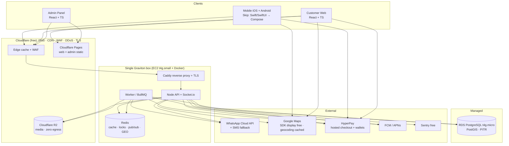

### 1.2 Authentication Flow (WhatsApp/SMS OTP → backend JWT)

```mermaid
sequenceDiagram
    participant C as Client App
    participant API as Fixly Backend
    participant OTP as WhatsApp Cloud API / SMS
    participant DB as PostgreSQL

    Note over C,API: client sends App Attest / Play Integrity token (anti-pump)
    C->>API: POST /auth/otp/request { phone, attestation }
    API->>API: rate-limit (phone+IP+device), verify attestation, gen code (hash in Redis, TTL 5m)
    API->>OTP: send code (WhatsApp template; SMS fallback)
    OTP-->>C: OTP delivered
    API-->>C: { otpToken } (opaque ref, no code)
    C->>API: POST /auth/otp/verify { phone, code, otpToken }
    API->>API: check hash + attempts + expiry (constant-time)
    API->>DB: upsert user by phone, load role
    API-->>C: { accessToken (15m), refreshToken (30d), user }
    Note over C,API: Subsequent calls: Authorization: Bearer <accessToken>
    C->>API: POST /auth/refresh (refresh cookie / token)
    API-->>C: new accessToken (rotates refresh token)
```

### 1.3 Real-Time Flow (Socket.io + Redis adapter)

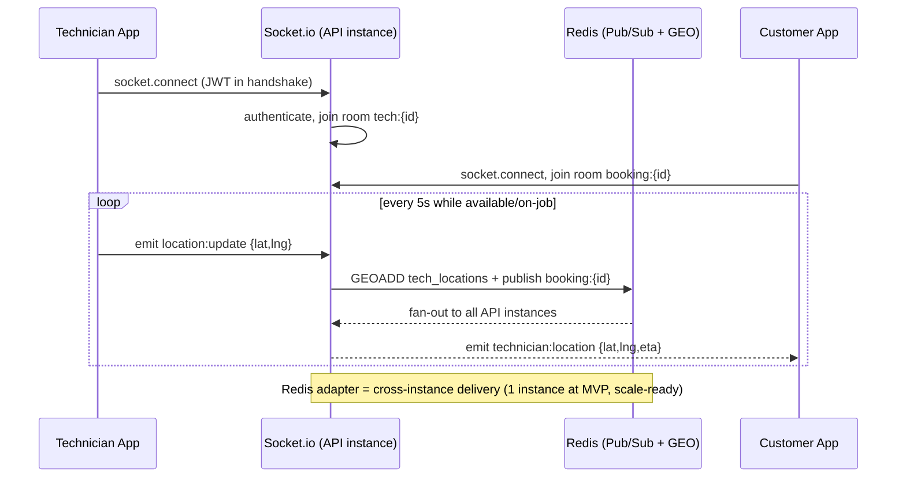

---

## 2. Database Design

PostgreSQL 15 + **PostGIS** (geo queries for nearby technicians). UUID PKs. `snake_case`. All money in **fils** (integer, 1 JOD = 1000 fils) to avoid float errors. All timestamps `TIMESTAMPTZ` in UTC.

### 2.1 ERD

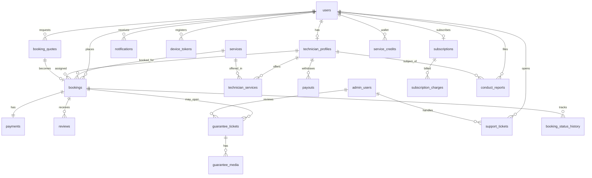

### 2.2 Schema (DDL)

```sql
-- ============ EXTENSIONS ============
CREATE EXTENSION IF NOT EXISTS "uuid-ossp";
CREATE EXTENSION IF NOT EXISTS postgis;
CREATE EXTENSION IF NOT EXISTS pg_trgm;

-- ============ ENUMS ============
CREATE TYPE user_role        AS ENUM ('customer','technician');
CREATE TYPE user_status      AS ENUM ('active','blocked','deleted');
CREATE TYPE tech_status      AS ENUM ('pending','approved','rejected','suspended');
CREATE TYPE booking_type     AS ENUM ('immediate','scheduled');
CREATE TYPE booking_status   AS ENUM (
  'pending','searching','accepted','technician_arriving',
  'in_progress','completed','cancelled','expired'
);
CREATE TYPE payment_status   AS ENUM (
  'pending','authorized','captured','partially_refunded','refunded','failed','voided'
);
CREATE TYPE payout_status    AS ENUM ('requested','processing','paid','failed');
CREATE TYPE guarantee_status AS ENUM ('open','under_review','approved','rejected','resolved');
CREATE TYPE ticket_status    AS ENUM ('open','in_progress','resolved','closed');
CREATE TYPE notif_channel    AS ENUM ('push','sms','in_app');
-- v1.5 business enums (§0)
CREATE TYPE subscription_status AS ENUM ('active','past_due','cancelled','expired');
CREATE TYPE quote_status        AS ENUM ('pending','quoted','accepted','declined','expired');
CREATE TYPE trust_tier          AS ENUM ('probation','verified','pro','elite');
CREATE TYPE credit_reason       AS ENUM ('late_compensation','referral','goodwill','promo','adjustment');
CREATE TYPE extra_work_status   AS ENUM ('none','proposed','approved','declined');

-- ============ USERS ============
CREATE TABLE users (
  id              UUID PRIMARY KEY DEFAULT uuid_generate_v4(),
  phone           VARCHAR(20)  NOT NULL UNIQUE,        -- E.164 +962...; verified via OTP (WhatsApp/SMS)
  full_name       VARCHAR(120),
  email           VARCHAR(160),
  role            user_role    NOT NULL DEFAULT 'customer',
  status          user_status  NOT NULL DEFAULT 'active',
  avatar_url      TEXT,
  locale          VARCHAR(5)   NOT NULL DEFAULT 'ar',
  -- push tokens normalized into device_tokens (multi-device); see below
  last_login_at   TIMESTAMPTZ,
  deleted_at      TIMESTAMPTZ,                        -- soft-delete; PII anonymized on purge
  created_at      TIMESTAMPTZ  NOT NULL DEFAULT now(),
  updated_at      TIMESTAMPTZ  NOT NULL DEFAULT now()
);
-- phone UNIQUE constraint already creates its index — no separate idx_users_phone needed
CREATE INDEX idx_users_role    ON users(role) WHERE status = 'active';

-- ============ TECHNICIAN PROFILES ============
CREATE TABLE technician_profiles (
  id                  UUID PRIMARY KEY DEFAULT uuid_generate_v4(),
  user_id             UUID NOT NULL UNIQUE REFERENCES users(id) ON DELETE CASCADE,
  status              tech_status NOT NULL DEFAULT 'pending',
  national_id_enc     BYTEA,                          -- AES-256-GCM (app-side, KMS data key); not indexable
  id_doc_url          TEXT,
  cert_doc_url        TEXT,
  selfie_url          TEXT,
  hourly_rate_fils    INTEGER CHECK (hourly_rate_fils BETWEEN 40000 AND 60000),
  is_available        BOOLEAN NOT NULL DEFAULT false,
  current_location    GEOGRAPHY(POINT,4326),          -- last-known SNAPSHOT only (accept/start/complete + 60s sampler). Live position = Redis GEO; see §2.4
  location_updated_at TIMESTAMPTZ,
  rating_avg          NUMERIC(3,2) NOT NULL DEFAULT 0, -- maintained by trg_review_rating (see below)
  rating_count        INTEGER NOT NULL DEFAULT 0,
  balance_fils        INTEGER NOT NULL DEFAULT 0,      -- cached balance; mutated only under row lock (see §2.5)
  consecutive_rejects SMALLINT NOT NULL DEFAULT 0,
  -- v1.5 trust & quality (§0.2 #1). trust_tier drives dispatch priority + guarantee liability.
  trust_tier          trust_tier  NOT NULL DEFAULT 'probation',
  bg_check_status     VARCHAR(12) NOT NULL DEFAULT 'pending',  -- pending | passed | failed
  skills_test_passed_at TIMESTAMPTZ,
  is_insured          BOOLEAN NOT NULL DEFAULT false,
  intro_video_url     TEXT,                                    -- profile trust video (Phase 2)
  jobs_completed      INTEGER NOT NULL DEFAULT 0,              -- lifetime; feeds nightly tier recompute
  off_platform_flags  SMALLINT NOT NULL DEFAULT 0,             -- upheld disintermediation reports (§0.2 #2)
  approved_by         UUID,
  approved_at         TIMESTAMPTZ,
  reject_reason       TEXT,
  created_at          TIMESTAMPTZ NOT NULL DEFAULT now(),
  updated_at          TIMESTAMPTZ NOT NULL DEFAULT now()
);
-- GiST index for "nearby technician" geo queries
CREATE INDEX idx_tech_location  ON technician_profiles USING GIST(current_location);
CREATE INDEX idx_tech_available ON technician_profiles(is_available, status)
  WHERE is_available = true AND status = 'approved';

-- ============ SERVICES (fixed-price catalog) ============
CREATE TABLE services (
  id               UUID PRIMARY KEY DEFAULT uuid_generate_v4(),
  slug             VARCHAR(40) NOT NULL UNIQUE,   -- electricity, plumbing, ac, painting, furniture
  name_ar          VARCHAR(80) NOT NULL,
  name_en          VARCHAR(80) NOT NULL,
  description_ar   TEXT,
  icon_url         TEXT,
  base_price_fils  INTEGER NOT NULL,              -- fixed price (e.g. 50000 = 50 JOD)
  est_duration_min INTEGER NOT NULL DEFAULT 60,
  is_active        BOOLEAN NOT NULL DEFAULT true,
  sort_order       SMALLINT NOT NULL DEFAULT 0,
  created_at       TIMESTAMPTZ NOT NULL DEFAULT now()
);

CREATE TABLE technician_services (
  technician_id UUID NOT NULL REFERENCES technician_profiles(id) ON DELETE CASCADE,
  service_id    UUID NOT NULL REFERENCES services(id) ON DELETE CASCADE,
  PRIMARY KEY (technician_id, service_id)
);

-- ============ BOOKINGS ============
CREATE TABLE bookings (
  id                 UUID PRIMARY KEY DEFAULT uuid_generate_v4(),
  ref_code           VARCHAR(12) NOT NULL UNIQUE,       -- human ref e.g. FX-8KД3
  customer_id        UUID NOT NULL REFERENCES users(id),
  technician_id      UUID REFERENCES technician_profiles(id),
  service_id         UUID NOT NULL REFERENCES services(id),
  type               booking_type   NOT NULL DEFAULT 'immediate',
  status             booking_status NOT NULL DEFAULT 'pending',
  version            INTEGER NOT NULL DEFAULT 0,        -- optimistic lock for status transitions
  scheduled_at       TIMESTAMPTZ,
  price_fils         INTEGER NOT NULL,                  -- snapshot of fixed price
  extra_fils         INTEGER NOT NULL DEFAULT 0,        -- additional work approved by customer
  platform_fee_fils  INTEGER NOT NULL DEFAULT 0,        -- 20% of total
  location           GEOGRAPHY(POINT,4326) NOT NULL,
  address_text       TEXT NOT NULL,
  notes              TEXT,                              -- "Gate code 1234"
  accepted_at        TIMESTAMPTZ,
  started_at         TIMESTAMPTZ,
  completed_at       TIMESTAMPTZ,
  cancelled_at       TIMESTAMPTZ,
  cancel_reason      TEXT,
  -- v1.5 SLA + fixed-price integrity + subscriber priority (§0.2 #3, §0.3)
  is_priority        BOOLEAN NOT NULL DEFAULT false,           -- subscriber priority dispatch
  sla_arrive_by      TIMESTAMPTZ,                              -- immediate bookings: accepted_at + 30m
  arrived_at         TIMESTAMPTZ,                              -- set by /tech/bookings/{id}/arrive
  late_comp_fils     INTEGER NOT NULL DEFAULT 0,               -- auto credit granted if arrival > SLA + 30m
  extra_status       extra_work_status NOT NULL DEFAULT 'none',-- extra-work approval gate (§0.2 #3)
  extra_note         TEXT,
  quote_id           UUID,                                     -- originating booking_quotes.id (no FK: avoids circular DDL)
  created_at         TIMESTAMPTZ NOT NULL DEFAULT now(),
  updated_at         TIMESTAMPTZ NOT NULL DEFAULT now()
);
CREATE INDEX idx_bookings_customer ON bookings(customer_id, created_at DESC);
CREATE INDEX idx_bookings_tech     ON bookings(technician_id, created_at DESC);
CREATE INDEX idx_bookings_status   ON bookings(status) WHERE status IN ('pending','searching','accepted','in_progress');
CREATE INDEX idx_bookings_location ON bookings USING GIST(location);

-- Append-only status audit
CREATE TABLE booking_status_history (
  id          BIGSERIAL PRIMARY KEY,
  booking_id  UUID NOT NULL REFERENCES bookings(id) ON DELETE CASCADE,
  from_status booking_status,
  to_status   booking_status NOT NULL,
  actor_id    UUID,
  meta        JSONB,
  created_at  TIMESTAMPTZ NOT NULL DEFAULT now()
);
CREATE INDEX idx_bsh_booking ON booking_status_history(booking_id, created_at);

-- ============ PAYMENTS ============
CREATE TABLE payments (
  id               UUID PRIMARY KEY DEFAULT uuid_generate_v4(),
  booking_id       UUID NOT NULL UNIQUE REFERENCES bookings(id),
  provider         VARCHAR(30) NOT NULL DEFAULT 'hyperpay',
  provider_ref     VARCHAR(120),                  -- gateway checkout/transaction id
  status           payment_status NOT NULL DEFAULT 'pending',
  amount_fils      INTEGER NOT NULL,              -- authorized amount
  captured_fils    INTEGER NOT NULL DEFAULT 0,
  refunded_fils    INTEGER NOT NULL DEFAULT 0,
  currency         CHAR(3) NOT NULL DEFAULT 'JOD',
  method           VARCHAR(12) NOT NULL DEFAULT 'card', -- card | applepay | googlepay
  checkout_id      VARCHAR(120),                  -- PSP hosted-checkout session id
  saved_token      VARCHAR(120),                  -- PSP registration token (card-on-file, 1-tap repeat)
  card_brand       VARCHAR(20),                   -- tokenized metadata only
  card_last4       CHAR(4),
  auth_expires_at  TIMESTAMPTZ,                   -- pre-auth hold TTL (PSP-dependent ~5-7d); reconciler acts before expiry
  capture_key      VARCHAR(80) UNIQUE,            -- idempotency: at most one capture per booking, ever
  authorized_at    TIMESTAMPTZ,
  captured_at      TIMESTAMPTZ,
  raw_callback     JSONB,                         -- gateway webhook payload (audit)
  created_at       TIMESTAMPTZ NOT NULL DEFAULT now(),
  updated_at       TIMESTAMPTZ NOT NULL DEFAULT now()
);
CREATE INDEX idx_payments_status   ON payments(status);
CREATE INDEX idx_payments_provider ON payments(provider_ref);

-- ============ REVIEWS (bidirectional: customer↔technician) ============
-- Only technician aggregates are denormalized (trg_review_rating updates technician_profiles).
-- Customer ratings are queried on demand — no hot path needs a customer rating_avg.
CREATE TABLE reviews (
  id            UUID PRIMARY KEY DEFAULT uuid_generate_v4(),
  booking_id    UUID NOT NULL REFERENCES bookings(id),
  author_id     UUID NOT NULL REFERENCES users(id),     -- who wrote it
  target_id     UUID NOT NULL REFERENCES users(id),     -- who is rated
  rating        SMALLINT NOT NULL CHECK (rating BETWEEN 1 AND 5),
  comment       TEXT,
  photo_urls    TEXT[],
  created_at    TIMESTAMPTZ NOT NULL DEFAULT now(),
  UNIQUE (booking_id, author_id)                          -- one review per side
);
CREATE INDEX idx_reviews_target ON reviews(target_id);

-- ============ GUARANTEES (30-day) ============
CREATE TABLE guarantee_tickets (
  id            UUID PRIMARY KEY DEFAULT uuid_generate_v4(),
  booking_id    UUID NOT NULL REFERENCES bookings(id),
  customer_id   UUID NOT NULL REFERENCES users(id),
  status        guarantee_status NOT NULL DEFAULT 'open',
  description   TEXT NOT NULL,
  expires_at    TIMESTAMPTZ NOT NULL,                    -- completed_at + 30d
  reviewed_by   UUID,
  admin_notes   TEXT,
  resolution    TEXT,
  followup_booking_id UUID REFERENCES bookings(id),       -- free return visit
  created_at    TIMESTAMPTZ NOT NULL DEFAULT now(),
  updated_at    TIMESTAMPTZ NOT NULL DEFAULT now()
);
CREATE INDEX idx_guarantee_status ON guarantee_tickets(status);

CREATE TABLE guarantee_media (
  id            UUID PRIMARY KEY DEFAULT uuid_generate_v4(),
  ticket_id     UUID NOT NULL REFERENCES guarantee_tickets(id) ON DELETE CASCADE,
  media_url     TEXT NOT NULL,
  media_type    VARCHAR(10) NOT NULL,                    -- image | video
  created_at    TIMESTAMPTZ NOT NULL DEFAULT now()
);

-- ============ PAYOUTS (technician withdrawals) ============
CREATE TABLE payouts (
  id              UUID PRIMARY KEY DEFAULT uuid_generate_v4(),
  technician_id   UUID NOT NULL REFERENCES technician_profiles(id),
  amount_fils     INTEGER NOT NULL CHECK (amount_fils >= 20000), -- min 20 JOD
  status          payout_status NOT NULL DEFAULT 'requested',
  bank_iban       VARCHAR(34),
  bank_name       VARCHAR(80),
  provider_ref    VARCHAR(120),
  requested_at    TIMESTAMPTZ NOT NULL DEFAULT now(),
  processed_at    TIMESTAMPTZ,
  failure_reason  TEXT
);
CREATE INDEX idx_payouts_tech ON payouts(technician_id, requested_at DESC);

-- Ledger: append-only journal; authoritative balance = SUM(amount_fils).
-- NO stored running balance (it races under concurrency). technician_profiles.balance_fils
-- is a CACHE updated in the SAME tx under SELECT ... FOR UPDATE on the tech row. See §2.5.
CREATE TABLE ledger_entries (
  id            BIGSERIAL PRIMARY KEY,
  technician_id UUID NOT NULL REFERENCES technician_profiles(id),
  booking_id    UUID REFERENCES bookings(id),
  payout_id     UUID REFERENCES payouts(id),
  entry_type    VARCHAR(20) NOT NULL,   -- earning | fee | payout | refund | adjustment
  amount_fils   INTEGER NOT NULL,       -- signed (+earning, -fee, -payout)
  ref_key       VARCHAR(80) UNIQUE,     -- dedupe key (e.g. 'capture:{bookingId}') => exactly-once posting
  created_at    TIMESTAMPTZ NOT NULL DEFAULT now()
);
CREATE INDEX idx_ledger_tech ON ledger_entries(technician_id, created_at);

-- ============ NOTIFICATIONS ============
CREATE TABLE notifications (
  id          UUID PRIMARY KEY DEFAULT uuid_generate_v4(),
  user_id     UUID NOT NULL REFERENCES users(id) ON DELETE CASCADE,
  channel     notif_channel NOT NULL DEFAULT 'push',
  title_ar    VARCHAR(160) NOT NULL,
  body_ar     TEXT NOT NULL,
  data        JSONB,
  is_read     BOOLEAN NOT NULL DEFAULT false,
  sent_at     TIMESTAMPTZ,
  created_at  TIMESTAMPTZ NOT NULL DEFAULT now()
);
CREATE INDEX idx_notif_user ON notifications(user_id, is_read, created_at DESC);

-- ============ SUPPORT ============
CREATE TABLE support_tickets (
  id           UUID PRIMARY KEY DEFAULT uuid_generate_v4(),
  user_id      UUID NOT NULL REFERENCES users(id),
  booking_id   UUID REFERENCES bookings(id),
  subject      VARCHAR(160),
  status       ticket_status NOT NULL DEFAULT 'open',
  handled_by   UUID,
  created_at   TIMESTAMPTZ NOT NULL DEFAULT now(),
  updated_at   TIMESTAMPTZ NOT NULL DEFAULT now()
);
CREATE TABLE support_messages (
  id           BIGSERIAL PRIMARY KEY,
  ticket_id    UUID NOT NULL REFERENCES support_tickets(id) ON DELETE CASCADE,
  sender_id    UUID NOT NULL,
  body         TEXT NOT NULL,
  created_at   TIMESTAMPTZ NOT NULL DEFAULT now()
);
CREATE INDEX idx_supportmsg_ticket ON support_messages(ticket_id, created_at);

-- ============ ADMIN ============
CREATE TABLE admin_users (
  id            UUID PRIMARY KEY DEFAULT uuid_generate_v4(),
  email         VARCHAR(160) NOT NULL UNIQUE,
  password_hash VARCHAR(255) NOT NULL,           -- argon2id
  full_name     VARCHAR(120),
  role          VARCHAR(30) NOT NULL DEFAULT 'ops', -- super_admin | ops | finance | support
  is_active     BOOLEAN NOT NULL DEFAULT true,
  last_login_at TIMESTAMPTZ,
  created_at    TIMESTAMPTZ NOT NULL DEFAULT now()
);

-- ============ REFRESH TOKENS (rotation + revocation) ============
CREATE TABLE refresh_tokens (
  id           UUID PRIMARY KEY DEFAULT uuid_generate_v4(),
  user_id      UUID NOT NULL REFERENCES users(id) ON DELETE CASCADE,
  token_hash   VARCHAR(255) NOT NULL,            -- store hash, never raw
  expires_at   TIMESTAMPTZ NOT NULL,
  revoked_at   TIMESTAMPTZ,
  device_info  VARCHAR(200),
  created_at   TIMESTAMPTZ NOT NULL DEFAULT now()
);
CREATE INDEX idx_refresh_user ON refresh_tokens(user_id) WHERE revoked_at IS NULL;

-- ============ DEVICE TOKENS (multi-device push) ============
CREATE TABLE device_tokens (
  id           UUID PRIMARY KEY DEFAULT uuid_generate_v4(),
  user_id      UUID NOT NULL REFERENCES users(id) ON DELETE CASCADE,
  token        TEXT NOT NULL UNIQUE,
  platform     VARCHAR(10) NOT NULL,             -- ios | android | web
  last_seen_at TIMESTAMPTZ NOT NULL DEFAULT now(),
  created_at   TIMESTAMPTZ NOT NULL DEFAULT now()
);
CREATE INDEX idx_devtok_user ON device_tokens(user_id);

-- ============ OUTBOX (transactional outbox; fixes dual-write) ============
-- Domain writes + outbox row commit in ONE tx. A relay worker polls unprocessed
-- rows and performs side effects (PSP calls, realtime emits, push) exactly-once.
CREATE TABLE outbox_events (
  id            BIGSERIAL PRIMARY KEY,
  aggregate     VARCHAR(40) NOT NULL,            -- booking | payment | payout ...
  aggregate_id  UUID NOT NULL,
  event_type    VARCHAR(60) NOT NULL,            -- booking.created | payment.capture.requested ...
  payload       JSONB NOT NULL,
  status        VARCHAR(12) NOT NULL DEFAULT 'pending', -- pending | processing | done | failed
  attempts      SMALLINT NOT NULL DEFAULT 0,
  next_retry_at TIMESTAMPTZ NOT NULL DEFAULT now(),
  created_at    TIMESTAMPTZ NOT NULL DEFAULT now()
);
CREATE INDEX idx_outbox_poll ON outbox_events(status, next_retry_at) WHERE status IN ('pending','failed');

-- ============ SUBSCRIPTIONS (Protection plan — §0.3, Phase 2) ============
CREATE TABLE subscriptions (
  id                    UUID PRIMARY KEY DEFAULT uuid_generate_v4(),
  customer_id           UUID NOT NULL REFERENCES users(id) ON DELETE CASCADE,
  plan_slug             VARCHAR(30) NOT NULL DEFAULT 'protect',
  status                subscription_status NOT NULL DEFAULT 'active',
  price_fils            INTEGER NOT NULL DEFAULT 5000,        -- 5 JOD / month
  discount_bps          INTEGER NOT NULL DEFAULT 1500,        -- 15% off each booking
  guarantee_days        SMALLINT NOT NULL DEFAULT 90,         -- extended guarantee window for members
  priority_dispatch     BOOLEAN NOT NULL DEFAULT true,
  inspection_every_days SMALLINT NOT NULL DEFAULT 90,         -- free quarterly inspection
  next_inspection_at    TIMESTAMPTZ,
  current_period_end    TIMESTAMPTZ NOT NULL,
  payment_token         VARCHAR(120),                         -- PSP card-on-file for recurring charge
  provider_ref          VARCHAR(120),
  cancelled_at          TIMESTAMPTZ,
  created_at            TIMESTAMPTZ NOT NULL DEFAULT now(),
  updated_at            TIMESTAMPTZ NOT NULL DEFAULT now()
);
-- at most one ACTIVE subscription per customer
CREATE UNIQUE INDEX idx_sub_active ON subscriptions(customer_id) WHERE status = 'active';

CREATE TABLE subscription_charges (
  id              UUID PRIMARY KEY DEFAULT uuid_generate_v4(),
  subscription_id UUID NOT NULL REFERENCES subscriptions(id) ON DELETE CASCADE,
  amount_fils     INTEGER NOT NULL,
  status          payment_status NOT NULL DEFAULT 'pending',
  provider_ref    VARCHAR(120),
  period_start    TIMESTAMPTZ NOT NULL,
  period_end      TIMESTAMPTZ NOT NULL,
  charged_at      TIMESTAMPTZ,
  created_at      TIMESTAMPTZ NOT NULL DEFAULT now()
);
CREATE INDEX idx_subcharge_sub ON subscription_charges(subscription_id, created_at DESC);

-- ============ BOOKING QUOTES (video pre-check — §0.3, Phase 2) ============
-- Customer uploads a problem video; a qualified tech/ops returns a FIRM price that
-- becomes the booking price — preserving "no surprises" for non-standard jobs.
CREATE TABLE booking_quotes (
  id            UUID PRIMARY KEY DEFAULT uuid_generate_v4(),
  customer_id   UUID NOT NULL REFERENCES users(id) ON DELETE CASCADE,
  service_id    UUID NOT NULL REFERENCES services(id),
  status        quote_status NOT NULL DEFAULT 'pending',
  video_url     TEXT NOT NULL,                     -- customer's problem video (R2, private)
  description   TEXT,
  quoted_fils   INTEGER,                           -- FIRM price set on review; becomes booking price
  quoted_by     UUID,                              -- technician or ops actor who priced it
  location      GEOGRAPHY(POINT,4326),
  address_text  TEXT,
  booking_id    UUID REFERENCES bookings(id),      -- set when accepted → booking
  expires_at    TIMESTAMPTZ NOT NULL,
  created_at    TIMESTAMPTZ NOT NULL DEFAULT now(),
  updated_at    TIMESTAMPTZ NOT NULL DEFAULT now()
);
CREATE INDEX idx_quotes_customer ON booking_quotes(customer_id, created_at DESC);
CREATE INDEX idx_quotes_status   ON booking_quotes(status) WHERE status IN ('pending','quoted');

-- ============ CUSTOMER SERVICE CREDITS (late comp / referral / goodwill — §0.3) ============
-- Customer wallet. Balance = SUM(amount_fils). Redemptions post negative rows.
-- Exactly-once grants via ref_key (e.g. 'latecomp:{bookingId}'); redemption never exceeds amount due.
CREATE TABLE service_credits (
  id            BIGSERIAL PRIMARY KEY,
  customer_id   UUID NOT NULL REFERENCES users(id) ON DELETE CASCADE,
  amount_fils   INTEGER NOT NULL,                  -- signed: + granted, - redeemed
  reason        credit_reason NOT NULL,
  booking_id    UUID REFERENCES bookings(id),
  ref_key       VARCHAR(80) UNIQUE,                -- exactly-once guard
  expires_at    TIMESTAMPTZ,
  created_at    TIMESTAMPTZ NOT NULL DEFAULT now()
);
CREATE INDEX idx_credits_customer ON service_credits(customer_id, created_at DESC);

-- ============ CONDUCT REPORTS (anti-disintermediation + quality — §0.2 #2) ============
CREATE TABLE conduct_reports (
  id              BIGSERIAL PRIMARY KEY,
  reporter_id     UUID NOT NULL REFERENCES users(id),
  subject_tech_id UUID REFERENCES technician_profiles(id),
  booking_id      UUID REFERENCES bookings(id),
  kind            VARCHAR(30) NOT NULL,            -- off_platform_solicit | no_show | quality | safety | other
  details         TEXT,
  status          VARCHAR(12) NOT NULL DEFAULT 'open', -- open | reviewing | upheld | dismissed
  resolved_by     UUID,
  created_at      TIMESTAMPTZ NOT NULL DEFAULT now()
);
CREATE INDEX idx_conduct_status  ON conduct_reports(status, created_at);
CREATE INDEX idx_conduct_subject ON conduct_reports(subject_tech_id);

-- ============ updated_at trigger ============
CREATE OR REPLACE FUNCTION set_updated_at() RETURNS trigger AS $$
BEGIN NEW.updated_at = now(); RETURN NEW; END; $$ LANGUAGE plpgsql;

CREATE TRIGGER trg_users_updated   BEFORE UPDATE ON users
  FOR EACH ROW EXECUTE FUNCTION set_updated_at();
CREATE TRIGGER trg_bookings_updated BEFORE UPDATE ON bookings
  FOR EACH ROW EXECUTE FUNCTION set_updated_at();
-- (repeat for technician_profiles, payments, guarantee_tickets, support_tickets, subscriptions, booking_quotes)

-- ============ rating maintenance (atomic, race-safe) ============
-- Recompute target's rating_avg/count from source rows on every review insert.
-- AVG over the table is correct under concurrency (no read-modify-write of a counter).
CREATE OR REPLACE FUNCTION refresh_target_rating() RETURNS trigger AS $$
BEGIN
  UPDATE technician_profiles tp
     SET rating_avg = sub.avg, rating_count = sub.cnt
    FROM (SELECT round(AVG(rating)::numeric,2) AS avg, COUNT(*) AS cnt
            FROM reviews WHERE target_id = NEW.target_id) sub
   WHERE tp.user_id = NEW.target_id;
  RETURN NEW;
END; $$ LANGUAGE plpgsql;

CREATE TRIGGER trg_review_rating AFTER INSERT ON reviews
  FOR EACH ROW EXECUTE FUNCTION refresh_target_rating();
```

### 2.3 Sample / Seed Data

```sql
INSERT INTO services (slug,name_ar,name_en,base_price_fils,est_duration_min,sort_order) VALUES
 ('electricity','كهرباء','Electricity',50000,60,1),
 ('plumbing','سباكة','Plumbing',40000,60,2),
 ('ac','تكييف','AC Cleaning',30000,45,3),
 ('painting','دهان','Painting',70000,180,4),
 ('furniture','أثاث','Furniture Assembly',35000,90,5);

INSERT INTO users (id,phone,full_name,role) VALUES
 ('11111111-1111-1111-1111-111111111111','+962790000001','أحمد العلي','customer'),
 ('22222222-2222-2222-2222-222222222222','+962790000002','محمد الخطيب','technician');

INSERT INTO technician_profiles (user_id,status,hourly_rate_fils,is_available,current_location,rating_avg,rating_count)
 VALUES ('22222222-2222-2222-2222-222222222222','approved',50000,true,
         ST_SetSRID(ST_MakePoint(35.9106,31.9539),4326),4.8,42);  -- Amman center

INSERT INTO admin_users (email,password_hash,role) VALUES
 ('ops@fixly.jo','$argon2id$v=19$m=65536,t=3,p=4$...','super_admin');
```

### 2.4 Location source of truth + nearby matching

**Live position lives in Redis only** (written every 5s via `location:update`). PostGIS
`current_location` is a **last-known snapshot** written on accept/start/complete and by a
60s sampler — it is for the admin map / audit, NOT live dispatch. This removes the
two-writers drift bug (Redis fresh vs PG stale, which made the old `location_updated_at > now()-30s`
filter return zero rows).

Dispatch matching reads Redis (sub-ms, always fresh):

```typescript
// nearby available techs within 10km using live positions
const near = await redis.geoSearch('tech_locations',
  { longitude: lng, latitude: lat },
  { radius: 10, unit: 'km' });                 // members = technician ids
// intersect with per-service availability set, then rank by distance
const eligible = await redis.sInter([`svc:${serviceId}:available`, /* near as a temp set */]);
```

A companion `last_seen` sorted-set TTLs members; a tech missing a heartbeat >30s is pruned
by the `location-pruner` job and dropped from dispatch. The PostGIS GiST index +
`idx_tech_available` are retained for the **admin live map** and cold-start fallback if Redis is down.

### 2.5 Money mutations — race-safe pattern

Every balance change posts a ledger row **and** updates the cached
`technician_profiles.balance_fils` inside one transaction, serialized per technician:

```sql
BEGIN;
  SELECT balance_fils FROM technician_profiles WHERE id = $tech FOR UPDATE;  -- row lock
  -- exactly-once guard: ref_key UNIQUE => duplicate posting raises, tx rolls back
  INSERT INTO ledger_entries (technician_id, booking_id, entry_type, amount_fils, ref_key)
    VALUES ($tech, $booking, 'earning', $net, 'capture:'||$booking);
  UPDATE technician_profiles SET balance_fils = balance_fils + $net WHERE id = $tech;
COMMIT;
-- balance_fils is only a cache; SUM(amount_fils) is authoritative and reconciled nightly.
```

### 2.6 Business-domain rules (trust · SLA · extra-work · subscription · quotes · credits)

These are the operational rules the tables above enforce. They are the heart of the product (§0) — implement them exactly.

- **Technician trust tiers & dispatch (§0.2 #1).** `trust_tier`: `probation` (new tech — dispatched only within a tight radius, lower job concurrency, auto-suspend on 2 upheld complaints), `verified` (passed docs + skills test + background check), `pro` (sustained ≥4.7 rating + volume), `elite` (top — first in priority ordering). A nightly `trust-tier-recompute` job derives tier from `rating_avg`, `jobs_completed`, and upheld `conduct_reports`/`off_platform_flags`. **Guarantee liability is bounded by only promoting proven techs.**
- **Arrival SLA & late compensation (§0.3).** For `immediate` bookings, on accept set `sla_arrive_by = accepted_at + interval '30 min'`. The tech calls `/tech/bookings/{id}/arrive` (or a geofence auto-marks) → `arrived_at`. If `arrived_at > sla_arrive_by + interval '30 min'`, grant a `late_compensation` credit of **20 JOD (20000 fils)** to the customer **exactly once** (`service_credits.ref_key = 'latecomp:'||booking_id`) and set `bookings.late_comp_fils`. Credits are redeemed at checkout **before** charging the card.
- **Extra-work approval — fixed-price integrity (§0.2 #3).** Tech `/tech/bookings/{id}/extra` `{ amountFils, note }` → `extra_status='proposed'` + notify customer. Customer `/bookings/{id}/extra/decide` `{ decision }` → `approved`|`declined`. At completion, capture may include `extra_fils` **only if `extra_status='approved'`**. Declined → base price only (or cancel per policy). **Never capture unapproved extra.**
- **Protection subscription (§0.3, Phase 2).** One `active` `subscriptions` row per customer (enforced by `idx_sub_active`), recurring via card-on-file (`payment_token`), billed monthly by the `subscription-biller` job into `subscription_charges` (fail → `past_due` → retry → `cancelled`/`expired`). Benefits applied **at booking time**: `is_priority=true` (dispatch ordering), `discount_bps` off `price_fils`, `guarantee_days=90`, quarterly free-inspection via `next_inspection_at`. **Subscription revenue is platform revenue — it does NOT post to `ledger_entries`** (that ledger is technician money only).
- **Video pre-check quotes (§0.3, Phase 2).** Customer uploads a problem video → `booking_quotes` (`pending`). A qualified tech/ops sets a **firm** `quoted_fils` (`quoted`). Customer `/quotes/{id}/accept` creates a booking with `price_fils = quoted_fils` and links `booking_quotes.booking_id`. Preserves "no surprises" for non-standard jobs.
- **Customer service credits (§0.3).** `service_credits` is the customer wallet (late comp, referral, goodwill, promo). Balance = `SUM(amount_fils)` per customer; a redemption posts a negative row and is **capped at the amount due** (never makes a charge negative). Grants are exactly-once via unique `ref_key`.

---

## 3. API Design

Base URL: `https://api.fixly.jo/v1`. JSON only. Auth via `Authorization: Bearer <accessToken>`.

### 3.1 Standard Envelopes

```json
// Success
{ "success": true, "data": { } , "meta": { "page": 1, "total": 100 } }

// Error
{ "success": false, "error": { "code": "BOOKING_NOT_FOUND", "message_ar": "الحجز غير موجود", "message_en": "Booking not found", "details": [] } }
```

**Error codes:** `UNAUTHENTICATED` (401), `FORBIDDEN` (403), `VALIDATION_ERROR` (422), `NOT_FOUND` (404), `RATE_LIMITED` (429), `PAYMENT_FAILED` (402), `CONFLICT` (409), `INTERNAL` (500).

### 3.2 OpenAPI (excerpt — full spec in `docs/openapi.yaml`)

```yaml
openapi: 3.0.3
info: { title: Fixly API, version: "1.0.0" }
servers: [{ url: https://api.fixly.jo/v1 }]
components:
  securitySchemes:
    bearerAuth: { type: http, scheme: bearer, bearerFormat: JWT }
  schemas:
    Booking:
      type: object
      properties:
        id: { type: string, format: uuid }
        refCode: { type: string }
        status: { type: string, enum: [pending,searching,accepted,technician_arriving,in_progress,completed,cancelled,expired] }
        serviceId: { type: string, format: uuid }
        priceFils: { type: integer }
        location: { type: object, properties: { lat: {type: number}, lng: {type: number} } }
        addressText: { type: string }
        createdAt: { type: string, format: date-time }

paths:
  # ---------- AUTH ----------
  /auth/otp/request:
    post:
      summary: Send OTP (WhatsApp Cloud API primary, SMS fallback)
      security: []            # public
      x-rate-limit: 10/min/ip, 5/hr/phone
      requestBody:
        required: true
        content: { application/json: { schema: { type: object, required: [phone, attestation],
          properties: { phone: {type: string, description: "E.164 +962..."},
            channel: {type: string, enum: [whatsapp, sms], default: whatsapp},  # server tries WhatsApp first, SMS fallback
            attestation: {type: string, description: "App Attest (iOS) / Play Integrity (Android) / reCAPTCHA (web) token — anti-pump"} } } } }
      responses:
        "200": { description: "OTP sent", content: { application/json: { schema: { type: object, properties: { otpToken: {type: string} } } } } }
        "429": { description: Rate limited }

  /auth/otp/verify:
    post:
      summary: Verify OTP, issue app JWTs (upserts user)
      security: []            # public
      x-rate-limit: 10/min/ip
      requestBody:
        required: true
        content: { application/json: { schema: { type: object, required: [phone, code, otpToken],
          properties: { phone: {type: string}, code: {type: string}, otpToken: {type: string},
            role: {type: string, enum: [customer, technician]} } } } }
      responses:
        "200": { description: OK, content: { application/json: { schema: { type: object,
          properties: { accessToken: {type: string}, refreshToken: {type: string}, user: {type: object} } } } } }
        "401": { description: Invalid/expired code }

  /auth/refresh:
    post:
      summary: Rotate access + refresh tokens (web reads HttpOnly cookie; mobile sends body)
      security: []
      x-rate-limit: 20/min/ip
      requestBody: { required: false, content: { application/json: { schema: { type: object,
        properties: { refreshToken: {type: string, description: "mobile only; web uses the HttpOnly cookie"} } } } } }
      responses: { "200": { description: OK }, "401": { description: Invalid/expired } }

  /auth/logout:
    post: { summary: Revoke refresh token, security: [{bearerAuth: []}], responses: {"204": {description: No Content}} }

  # ---------- CUSTOMER ----------
  /services:
    get:
      summary: List active services (fixed prices)
      security: []
      x-rate-limit: 60/min/ip
      responses: { "200": { description: Array of Service } }

  /bookings:
    post:
      summary: Create booking; returns hosted-checkout URL (or charges saved card / wallet token)
      security: [{bearerAuth: []}]
      x-rate-limit: 20/min/user
      parameters: [{name: Idempotency-Key, in: header, required: true, schema: {type: string}}]
      requestBody:
        required: true
        content: { application/json: { schema: { type: object,
          required: [serviceId, type, location, addressText],
          properties: {
            serviceId: {type: string, format: uuid},
            type: {type: string, enum: [immediate, scheduled]},
            scheduledAt: {type: string, format: date-time},
            location: {type: object, properties: {lat: {type: number}, lng: {type: number}}},
            addressText: {type: string},
            notes: {type: string},
            payment: {type: object, description: "method=card -> hosted checkout; or savedToken / walletToken",
              properties: { method: {type: string, enum: [card, applepay, googlepay]},
                savedToken: {type: string}, walletToken: {type: string} } } } } } }
      responses:
        "201": { description: "Booking created (status=pending). Returns { booking, payment:{ checkoutUrl?, checkoutId } }. New card => open checkoutUrl in system browser; saved card / wallet => authorized server-to-server, no UI." }
        "422": { description: Validation error }
    get:
      summary: List my bookings (paginated)
      security: [{bearerAuth: []}]
      parameters: [{name: status, in: query, schema: {type: string}}, {name: page, in: query, schema: {type: integer}}]
      responses: { "200": { description: Paginated bookings } }

  /bookings/{id}:
    get: { summary: Booking detail, security: [{bearerAuth: []}], responses: {"200": {description: Booking}} }

  /bookings/{id}/cancel:
    post:
      summary: Cancel booking (applies refund policy)
      security: [{bearerAuth: []}]
      x-rate-limit: 10/min/user
      requestBody: { content: { application/json: { schema: { type: object, properties: { reason: {type: string} } } } } }
      responses: { "200": { description: Cancelled + refund info }, "409": { description: Cannot cancel in current status } }

  /bookings/{id}/review:
    post:
      summary: Submit rating for technician
      security: [{bearerAuth: []}]
      requestBody: { required: true, content: { application/json: { schema: { type: object, required: [rating],
        properties: { rating: {type: integer, minimum: 1, maximum: 5}, comment: {type: string}, photoUrls: {type: array, items: {type: string}} } } } } }
      responses: { "201": { description: Review created } }

  # ---------- PAYMENTS ----------
  /payments/webhook:
    post:
      summary: PSP server-to-server callback — AUTHORITATIVE payment result
      security: []            # public; verified by signature, NOT bearer
      description: HyperPay posts auth/capture/refund results here. Signature-verified, idempotent (dedupe on event id), raw body stored in payments.raw_callback, then booking advanced via outbox. Never trust the browser redirect for success — only this.
      responses: { "200": { description: Acknowledged } }

  /payments/wallet:
    post:
      summary: Authorize via Apple Pay / Google Pay token (native sheet)
      security: [{bearerAuth: []}]
      parameters: [{name: Idempotency-Key, in: header, required: true, schema: {type: string}}]
      requestBody: { required: true, content: { application/json: { schema: { type: object, required: [bookingId, provider, walletToken],
        properties: { bookingId: {type: string}, provider: {type: string, enum: [applepay, googlepay]}, walletToken: {type: string} } } } } }
      responses: { "200": { description: Authorized (hold placed) }, "402": { description: Wallet auth failed } }

  /payments/methods:
    get: { summary: List saved cards (card-on-file, masked), security: [{bearerAuth: []}], responses: {"200": {description: List}} }
    delete: { summary: Remove a saved card, security: [{bearerAuth: []}], responses: {"204": {description: Removed}} }

  /guarantees:
    post:
      summary: Open 30-day guarantee ticket
      security: [{bearerAuth: []}]
      requestBody: { required: true, content: { application/json: { schema: { type: object, required: [bookingId, description],
        properties: { bookingId: {type: string}, description: {type: string}, mediaUrls: {type: array, items: {type: string}} } } } } }
      responses: { "201": { description: Ticket opened }, "409": { description: Outside 30-day window } }

  /uploads/presign:
    post:
      summary: Get R2 presigned PUT URL for media (S3-compatible)
      security: [{bearerAuth: []}]
      x-rate-limit: 30/min/user
      requestBody: { content: { application/json: { schema: { type: object, properties: { contentType: {type: string}, kind: {type: string, enum: [guarantee, review, doc]} } } } } }
      responses: { "200": { description: "{ uploadUrl, fileUrl }" } }

  /notifications:
    get: { summary: List my notifications, security: [{bearerAuth: []}], responses: {"200": {description: List}} }

  /devices:
    post:
      summary: Register/refresh a push token (multi-device)
      security: [{bearerAuth: []}]
      requestBody: { required: true, content: { application/json: { schema: { type: object, required: [token, platform],
        properties: { token: {type: string}, platform: {type: string, enum: [ios, android, web]} } } } } }
      responses: { "204": { description: Registered } }
    delete: { summary: Deregister token (logout), security: [{bearerAuth: []}], responses: {"204": {description: Removed}} }

  /support/tickets:
    post: { summary: Open support ticket, security: [{bearerAuth: []}], responses: {"201": {description: Created}} }

  # ---------- TECHNICIAN ----------
  /tech/onboarding:
    post:
      summary: Submit onboarding docs (ID, cert, selfie)
      security: [{bearerAuth: []}]
      responses: { "201": { description: Profile pending approval } }

  /tech/availability:
    patch:
      summary: Toggle availability on/off
      security: [{bearerAuth: []}]
      requestBody: { content: { application/json: { schema: { type: object, properties: { isAvailable: {type: boolean} } } } } }
      responses: { "200": { description: OK } }

  /tech/bookings/nearby:
    get:
      summary: Nearby pending bookings (list + geo)
      security: [{bearerAuth: []}]
      x-rate-limit: 60/min/user
      responses: { "200": { description: Array with distance } }

  /tech/bookings/{id}/accept:
    post:
      summary: Accept a booking (idempotent, Redis lock)
      security: [{bearerAuth: []}]
      responses: { "200": { description: Assigned }, "409": { description: Already taken } }

  /tech/bookings/{id}/reject:
    post: { summary: Reject booking, security: [{bearerAuth: []}], responses: {"200": {description: OK}} }

  /tech/bookings/{id}/start:
    post: { summary: Start service, security: [{bearerAuth: []}], responses: {"200": {description: in_progress}} }

  /tech/bookings/{id}/complete:
    post:
      summary: Complete service (captures payment — idempotent)
      security: [{bearerAuth: []}]
      parameters: [{name: Idempotency-Key, in: header, required: true, schema: {type: string}}]
      requestBody: { content: { application/json: { schema: { type: object, properties: { extraFils: {type: integer}, extraNote: {type: string} } } } } }
      responses: { "200": { description: "completed + payment captured (replay returns same result, never double-charges)" }, "409": { description: Invalid state transition } }

  /tech/earnings:
    get: { summary: Earnings dashboard + balance, security: [{bearerAuth: []}], responses: {"200": {description: Earnings}} }

  /tech/payouts:
    post:
      summary: Request withdrawal (min 20 JOD, 1/24h)
      security: [{bearerAuth: []}]
      x-rate-limit: 5/day/user
      requestBody: { required: true, content: { application/json: { schema: { type: object, required: [amountFils, iban],
        properties: { amountFils: {type: integer, minimum: 20000}, iban: {type: string} } } } } }
      responses: { "201": { description: Payout requested }, "409": { description: Below min or within 24h } }

  # ---------- ADMIN ----------
  /admin/auth/login:
    post: { summary: Admin email+password login, security: [], x-rate-limit: 5/min/ip, responses: {"200": {description: JWT}} }

  /admin/technicians:
    get: { summary: List technicians by status, security: [{bearerAuth: []}], responses: {"200": {description: List}} }

  /admin/technicians/{id}/approve:
    post: { summary: Approve technician, security: [{bearerAuth: []}], responses: {"200": {description: Approved}} }

  /admin/technicians/{id}/reject:
    post: { summary: Reject with reason, security: [{bearerAuth: []}], responses: {"200": {description: Rejected}} }

  /admin/bookings/live:
    get: { summary: Live active bookings (map), security: [{bearerAuth: []}], responses: {"200": {description: List}} }

  /admin/guarantees/{id}/decide:
    post:
      summary: Approve/reject guarantee
      security: [{bearerAuth: []}]
      requestBody: { content: { application/json: { schema: { type: object, required: [decision],
        properties: { decision: {type: string, enum: [approved, rejected]}, notes: {type: string} } } } } }
      responses: { "200": { description: Decision recorded } }

  /admin/reports/financial:
    get:
      summary: Revenue/fees/payouts (CSV export)
      security: [{bearerAuth: []}]
      parameters: [{name: from, in: query}, {name: to, in: query}, {name: format, in: query, schema: {type: string, enum: [json, csv]}}]
      responses: { "200": { description: Report } }

  /admin/notifications/broadcast:
    post:
      summary: Bulk push to all/segment
      security: [{bearerAuth: []}]
      requestBody: { content: { application/json: { schema: { type: object,
        properties: { segment: {type: string, enum: [all, customers, technicians]}, titleAr: {type: string}, bodyAr: {type: string} } } } } }
      responses: { "202": { description: Queued } }
```

### 3.3 WebSocket (Socket.io) Events

| Event | Direction | Payload | Notes |
|-------|-----------|---------|-------|
| `connect` | C→S | `auth: { token }` in handshake | JWT verified in middleware |
| `location:update` | Tech→S | `{ lat, lng }` | every 5s when available |
| `technician:location` | S→Customer | `{ bookingId, lat, lng, etaSec }` | room `booking:{id}` |
| `booking:new` | S→Tech | `{ bookingId, serviceId, distanceM, priceFils }` | nearby techs |
| `booking:status` | S→both | `{ bookingId, status }` | status transitions |
| `booking:accepted` | S→Customer | `{ bookingId, technician }` | |
| `notification:new` | S→User | `{ id, titleAr, bodyAr, data }` | in-app badge |
| `support:message` | bi | `{ ticketId, body }` | live chat |
| `disconnect` | C→S | — | mark tech offline after grace |

Rate limiting on `location:update`: server samples max 1/2s per socket; excess dropped.

**v1.5 events (§0):** `booking:extra_proposed` (S→Customer `{ bookingId, amountFils, note }`), `booking:extra_decided` (S→Tech `{ bookingId, decision }`), `quote:ready` (S→Customer `{ quoteId, quotedFils }`), `credit:granted` (S→Customer `{ amountFils, reason }`).

### 3.4 Business-feature Endpoints (subscription · quotes · SLA · quality)

Same envelopes, auth, and error codes as §3.1–§3.2; `Idempotency-Key` required on any money-moving POST. Full definitions land in `docs/openapi.yaml`.

**Customer**
| Method + path | Purpose | Notes |
|---|---|---|
| `POST /subscriptions` | Start Protection plan | `{ paymentToken }` (card-on-file recurring) → `201 { subscription }`. *Phase 2* |
| `GET /subscriptions/me` | Current plan | period end, `nextInspectionAt`, benefits |
| `POST /subscriptions/cancel` | Cancel at period end | stays active until `current_period_end` |
| `GET /credits/me` | Service-credit balance + history | balance = `SUM(amount_fils)` |
| `POST /quotes` | Upload problem video for a firm quote | `{ serviceId, videoUrl, description, location, addressText }` → `201 { quote }`. *Phase 2* |
| `GET /quotes/{id}` | Quote status + `quotedFils` | |
| `POST /quotes/{id}/accept` | Convert quote → booking at `quotedFils` | then pay as normal; `409` if expired/declined |
| `POST /bookings/{id}/extra/decide` | Approve/decline proposed extra work | `{ decision: approve\|decline }` — guards fixed price (§0.2 #3) |
| `POST /conduct-reports` | Report off-platform solicitation / issue | `{ subjectTechId?, bookingId?, kind, details }` |

**Technician**
| Method + path | Purpose | Notes |
|---|---|---|
| `POST /tech/bookings/{id}/arrive` | Mark arrival | sets `arrived_at`; triggers SLA/late-comp check. Idempotent |
| `POST /tech/bookings/{id}/extra` | Propose extra work | `{ amountFils, note }` → `extra_status='proposed'`; needs customer approval before capture |
| `POST /tech/intro-video` | Set profile intro video | `{ videoUrl }`. *Phase 2* |

**Admin (quality & growth)**
| Method + path | Purpose | Notes |
|---|---|---|
| `GET /admin/quality/techs` | Trust-tier board | tiers, bg-check queue, flag counts |
| `POST /admin/technicians/{id}/trust-tier` | Set/override tier | `{ tier, reason }` (audited) |
| `POST /admin/technicians/{id}/bg-check` | Record background-check result | `{ result: passed\|failed, notes }` |
| `GET /admin/conduct-reports` | Report queue | + `POST /admin/conduct-reports/{id}/resolve` `{ decision: upheld\|dismissed }` (upheld → `off_platform_flags += 1`) |
| `GET /admin/subscriptions` | MRR + active/past-due counts | growth dashboard |

---

## 4. Technology Stack

| Layer | Technology | Version | Notes |
|-------|-----------|---------|-------|
| **Backend runtime** | Node.js | 20.x LTS | |
| | TypeScript | 5.4.x | strict mode |
| | Express | 4.19.x | |
| | Socket.io | 4.7.x | + `@socket.io/redis-adapter` 8.x |
| | Prisma ORM | 5.14.x | with PostGIS via raw queries |
| | Zod | 3.23.x | request validation |
| | BullMQ | 5.x | background jobs (Redis) |
| | Pino | 9.x | structured logging |
| | WhatsApp Cloud API (Meta) | Graph v20+ | primary OTP channel (cheap) — behind `OtpProvider` |
| | SMS fallback (Twilio / local aggregator) | — | fallback only; swappable |
| **Database** | PostgreSQL | 15.x | + PostGIS 3.4 (admin map / fallback only) |
| | Redis | 7.2.x | cache, locks, pub/sub, geo (runs on the app box) |
| **Web (Customer)** | React | 18.3.x | Vite 5.x |
| | TypeScript | 5.4.x | |
| | Tailwind CSS | 3.4.x | RTL configured |
| | shadcn/ui | latest | Radix-based |
| | Redux Toolkit | 2.2.x | + RTK Query |
| | socket.io-client | 4.7.x | |
| | react-i18next | 14.x | ar/en |
| **Admin Panel** | React + TS | 18.3 / 5.4 | same stack, separate app |
| | TanStack Table | 8.x | data grids |
| | Recharts | 2.x | financial charts |
| **Mobile (Skip)** | Swift / SwiftUI | 5.9+ / iOS 16+ | **single codebase** → transpiles to Kotlin + Jetpack Compose for Android |
| | Skip (skip.tools) | latest (OSS) | Swift→Compose transpiler; needs Xcode + Android Studio |
| | URLSession + async/await | — | networking (no Alamofire) |
| | Socket.IO-Client-Swift | 16.x | realtime (bridged on Android) |
| | Google Maps SDK (iOS) | 8.x | iOS map — `GMSMapView` via `UIViewRepresentable` (platform-specific) |
| | Google Maps Compose (Android) | `maps-compose` 6.x | Android map via Skip `ComposeView` (platform-specific) |
| | Apple Pay (PassKit) | — | native Swift, no bridge |
| | Google Pay | latest | Kotlin platform module (Skip `#if SKIP`) |
| | Push: APNs / FCM | — | per-platform native |
| **Infra** | Docker + docker-compose | 26.x | one Graviton box runs API + worker + Redis + Caddy |
| | AWS EC2 t4g.small (Graviton) | — | MVP compute (ARM, Bahrain) — instance IAM role for SSM/RDS; no ECS/EKS/ALB/NAT. (Lightsail is cheaper-flat but has no IAM roles → static keys, so EC2 preferred) |
| | Caddy | 2.x | reverse proxy + auto-TLS at origin |
| | Cloudflare (free) | — | DNS, CDN, WAF, DDoS, TLS; **Pages** (web/admin) + **R2** (media) |
| | RDS PostgreSQL | `db.t4g.micro` | only managed piece (money DB needs PITR) |
| | Terraform | 1.8.x | IaC |
| | GitHub Actions | — | CI/CD |
| **Observability** | Sentry (free tier) | latest | errors + light perf (replaces OTel/Prometheus at MVP) |
| | Cloudflare Analytics + UptimeRobot | free | traffic + uptime/health |

> **Lowest-cost MVP (see §6 + §9):** one Graviton box (Docker: API + worker + Redis + Caddy) behind **Cloudflare free** (CDN/WAF/TLS) + **Pages** (static) + **R2** (media); one **RDS `db.t4g.micro`** for the money DB. **Dropped as not-needed-yet:** ECS/EKS, ALB, NAT GW, ElastiCache, CloudFront, AWS WAF, MongoDB, Secrets Manager (→ free SSM Parameter Store), distributed tracing, self-host Prometheus/Grafana. All are documented **scale-up triggers** (§6), not launch items.

---

## 5. Security Design

### 5.1 Checklist

- [x] **AuthN:** **backend-issued OTP via WhatsApp Cloud API (primary) + SMS fallback** — client calls `/auth/otp/request` + `/auth/otp/verify`; on success backend issues short-lived **access JWT (15 min)** + **refresh token (30 d, rotated, hashed at rest)**. Refresh reuse detection revokes the whole token family. No Firebase (plain REST = Skip/web compatible).
- [x] **OTP abuse / SMS-pumping defense:** OTP flows through OUR API, so abuse controls live where we control them. **Backend generates the code and stores only its hash in Redis (TTL 5m, max 5 attempts)** — providers only DELIVER. `/auth/otp/request` requires a device-attestation token (**App Attest** iOS / **Play Integrity** Android / **reCAPTCHA Enterprise** web), enforces per-phone (5/hr) + per-IP (10/min) + global circuit-breaker caps, geo/prefix-restricts to +962 (reject premium/virtual ranges), and alerts on send-rate spikes. WhatsApp-first keeps cost down; SMS only on fallback.
- [x] **Token storage:** mobile = OS Keychain (iOS) / EncryptedSharedPreferences+Keystore (Android). **Web = access token in memory only; refresh token in `HttpOnly; Secure; SameSite=Strict` cookie** — never `localStorage` (XSS-exfiltratable). `/auth/refresh` reads the cookie.
- [x] **AuthZ:** Role-based middleware (`customer`/`technician`/`admin`). Resource ownership checks on every booking/payment route.
- [x] **JWT:** RS256 (asymmetric); private key in SSM Parameter Store (SecureString); `kid` rotation supported.
- [x] **Transport:** TLS 1.2+ everywhere; HSTS. Cloudflare edge TLS + **Caddy auto-TLS (Let's Encrypt)** at origin. Origin firewall allows **only Cloudflare IP ranges** (no direct origin access).
- [x] **Encryption at rest:** RDS (AWS KMS, AES-256) + R2 (encrypted) + encrypted box volume. National IDs / IBAN stored in `BYTEA` columns (`national_id_enc`), app-side **AES-256-GCM** with a KMS/SSM-held data key. Tradeoff: encrypted columns aren't searchable/indexable (acceptable — no lookup by national ID).
- [x] **PCI-DSS (SAQ-A):** **Card data never touches our servers or app.** Cards entered on HyperPay's **hosted checkout page**, opened in the **system browser** (SFSafariViewController / Chrome Custom Tabs / external browser — NOT an embedded WebView, and no JS injection into the card page). Apple Pay / Google Pay pass **encrypted wallet tokens** (not PAN) to the PSP. We store only `card_brand` + `last4` + PSP token. **Payment result is authoritative via signed webhook, never the browser redirect.**
- [x] **Apple Pay / Google Pay setup:** Apple **Merchant ID** + domain verification (`.well-known/apple-developer-merchantid-domain-association`) + merchant identity cert (PSP may be merchant-of-record). App Store: real-world home-maintenance services are **exempt from IAP** (like ride-hailing) — external payment is allowed.
- [x] **Input validation:** Zod schemas on every endpoint; reject unknown keys.
- [x] **SQL injection:** Prisma parameterized queries; raw geo queries use bound params only.
- [x] **XSS:** React auto-escaping; CSP header; sanitize user HTML (DOMPurify) in admin views.
- [x] **CORS:** allowlist (`app.fixly.jo`, `admin.fixly.jo`); credentials gated.
- [x] **Rate limiting:** Redis token-bucket per IP + per user (see API table). OTP endpoints hard-capped (10/min/IP, 5/hr/phone).
- [x] **CSRF:** API calls use the Bearer access token (immune). The refresh cookie is `httpOnly` + `SameSite=Strict`, which alone blocks cross-site submission — no separate double-submit token is issued. Admin panel = same pattern.
- [x] **File uploads:** **R2 presigned PUT** (S3-compatible), content-type + size validated, private bucket, served via Cloudflare signed URLs. (AV scanning deferred to scale-up — not required at MVP volume.)
- [x] **Secrets:** **SSM Parameter Store (SecureString, free)** + IAM role; injected at container start, not baked into images; `.env` git-ignored. JWT private key (PEM) loaded from Parameter Store as a file, not an env var.
- [x] **WAF / DDoS:** Cloudflare (free) managed rules + rate limiting + DDoS + bot mitigation at the edge — sheds abuse before it reaches the origin.
- [x] **Phone masking:** Call connect via Twilio proxy numbers — customer↔tech never see real numbers.
- [x] **Privacy / GDPR-style:** consent at signup; data export + delete endpoints; PII access audit-logged. Delete = soft-delete (`deleted_at`) → 30-day grace → **anonymize, not hard-delete**, for rows tied to financial/legal records (bookings, payments, ledger retained per JO tax law): strip name/phone/email/national-ID, keep the immutable money trail.
- [x] **Idempotency:** `Idempotency-Key` header on booking-create + payment-capture (Redis dedupe + unique `capture_key`). Side effects (PSP / realtime / push) run via **transactional outbox** (`outbox_events`) for exactly-once delivery — see §15.1.
- [x] **Audit log:** all admin actions + money movements → append-only `ledger_entries` + `booking_status_history` + structured Pino audit logs (Postgres + log sink). (No MongoDB.)

### 5.2 Booking Race Condition (double-accept prevention)

Technician accept uses a **Redis distributed lock + DB conditional update**:

```sql
UPDATE bookings
   SET technician_id=$tech, status='accepted', accepted_at=now(), version=version+1
WHERE id=$id AND status='searching' AND technician_id IS NULL AND version=$expectedVersion
RETURNING id;   -- zero rows => already taken / stale => 409
```

All other status transitions (start, complete, cancel) use the same `AND status=$from AND version=$expectedVersion` optimistic guard, so a concurrent cancel-vs-complete cannot both win.

---

## 6. Scalability Design

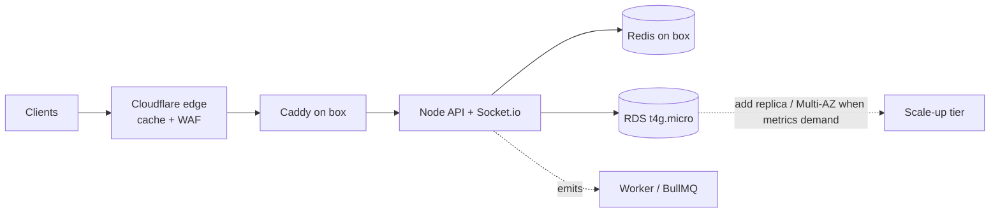

> **Right-size for actual load.** Year-1 = 1,000 users / 500 bookings **per month** ≈ **1–5 req/s peak**. One small box handles this with huge headroom. The work below is about **shedding load before it reaches the origin** and **not paying for idle capacity**.

**Load-shedding / efficiency (do at MVP — directive: reduce server load):**
- **Edge cache (Cloudflare, free):** `GET /services` + all static get `Cache-Control` + ETag → served from Cloudflare edge → **near-zero origin hits**. Biggest single win.
- **Multi-layer cache:** in-process LRU (per box, ms TTL) → Redis (shared) → Postgres. **Cache-aside** for services, technician profiles, booking read-models; invalidate on write.
- **HTTP caching:** ETag / `Cache-Control` on cacheable GETs; `304` revalidation.
- **Compression:** Brotli/gzip at Cloudflare + Caddy.
- **DB efficiency:** tuned Prisma pool; **no N+1** (explicit `select`/`include`); **keyset (cursor) pagination**, never `OFFSET` on big lists; partial indexes (already in schema); `EXPLAIN`-checked hot queries.
- **Work off the request path:** BullMQ for push/payout/reports/outbox.
- **Realtime efficiency:** location sampled 1/2s server-side; **Redis GEO** for matching (no PG geo on the hot path); Socket.io Redis adapter kept so scaling out is config-only.
- **Rate limiting at the edge** (Cloudflare) before origin; Redis token-bucket as a second layer.

**MVP tier (launch):**
- **Compute:** 1× Graviton box (EC2 `t4g.small`, instance IAM role), Docker: API + worker + Redis + Caddy.
- **DB:** 1× RDS `db.t4g.micro` (managed, for PITR). Redis on the box with **AOF persistence ON** — BullMQ jobs + distributed locks + OTP hashes live there (cache is rebuildable; money lives in PG).
- **Static/media:** Cloudflare Pages (web/admin) + R2 (media). No CloudFront/S3.
- **Queues / scheduled jobs (BullMQ):** `outbox-relay` (~1s), `dispatch-timeout` (90s → expand radius → `expired` + auto-void), `scheduled-dispatch`, `preauth-reconciler`, `balance-reconcile` (nightly), `location-pruner`, **`trust-tier-recompute`** (nightly — §0.2 #1), **`subscription-biller`** (monthly recurring charges — Phase 2), **`inspection-scheduler`** (subscriber quarterly free inspection — Phase 2).

**Scale-up triggers (only when a metric says so):**
| Add | Trigger |
|-----|---------|
| Split API/worker to own boxes or Fargate | box CPU > 60% sustained |
| Managed Redis (ElastiCache) | Redis competes with API for box memory |
| RDS bigger + read replica | RDS CPU > 60% or report queries slow |
| RDS Multi-AZ | before serious revenue / SLA |
| ALB + 2+ API instances | need HA / horizontal scale |
| Distributed tracing, Prometheus/Grafana, AV scan | when debugging/compliance demands it |

At **10k users / 5k bookings-mo**: still one beefier box (or 2 small + ALB) + `db.t4g.medium` + maybe managed Redis. Modest.

---

## 7. File Structure

```
fixly/
├── backend/                       # Clean / hexagonal architecture (ports & adapters)
│   ├── src/
│   │   ├── domain/                # ENTITIES + value objects + PORTS (interfaces). Zero framework deps.
│   │   │   ├── booking/           # Booking entity, BookingRepository (port), transition policies
│   │   │   ├── payment/           # Payment entity, PaymentProvider (port)
│   │   │   ├── technician/  ledger/  guarantee/  review/  otp/
│   │   ├── application/           # USE CASES (orchestration) — depend ONLY on domain ports
│   │   │   ├── booking/           # CreateBooking, AcceptBooking, CompleteBooking, CancelBooking
│   │   │   ├── auth/              # RequestOtp, VerifyOtp, RefreshSession
│   │   │   └── payment/ guarantee/ payout/ ...
│   │   ├── infrastructure/        # ADAPTERS implementing ports
│   │   │   ├── db/                # Prisma repositories, migrations, seed
│   │   │   ├── cache/             # Redis + in-process LRU (cache-aside helpers)
│   │   │   ├── payment/           # HyperPayProvider (hosted checkout, wallet, webhook verify)
│   │   │   ├── otp/               # WhatsAppCloudProvider, SmsFallbackProvider (FallbackChain)
│   │   │   ├── realtime/          # socket.io + redis adapter
│   │   │   ├── queue/             # BullMQ queues + workers (outbox-relay, dispatch-timeout, …)
│   │   │   ├── push/  storage/    # FCM/APNs ; R2 (S3-compatible) client
│   │   │   └── config/            # env, ssm params, db/redis clients
│   │   ├── interface/             # delivery layer
│   │   │   ├── http/              # Express controllers, routes, zod DTOs
│   │   │   └── middleware/        # auth, rbac, rateLimit, idempotency, errorHandler
│   │   └── server.ts             # composition root (wires adapters → use cases)
│   ├── tests/                     # unit (domain + use-cases) + integration (supertest)
│   ├── prisma/schema.prisma
│   ├── Dockerfile  package.json  tsconfig.json
│
├── web/                           # Customer web (React + TS, Vite)
│   └── src/ app/  components/ui/(shadcn)  features/{booking,tracking,auth,payment}/  store/(rtk)  lib/  i18n/(ar,en)
├── admin/                         # Admin panel (React + TS): technicians/ bookings/ guarantees/ reports/ broadcast/
│
├── mobile/                        # SINGLE Skip codebase — Clean Architecture (pure Swift)
│   ├── Sources/Fixly/
│   │   ├── Presentation/          # SwiftUI Views + ViewModels (ObservableObject)
│   │   ├── Domain/                # Entities + UseCases + Repository PROTOCOLS (ports)
│   │   ├── Data/                  # Repository impls, APIClient (URLSession), DTOs, local cache
│   │   ├── DI/                    # composition root / dependency container
│   │   └── Platform/              # platform-specific (Skip #if SKIP)
│   │       ├── GoogleMap.ios.swift     # iOS: Google Maps SDK (GMSMapView)
│   │       ├── GoogleMap.android.kt    # Android: Google Maps Compose (ComposeView)
│   │       ├── ApplePay.swift          # native PassKit (iOS)
│   │       └── GooglePay.android.kt    # native Google Pay (Android)
│   ├── Skip/skip.yml   Package.swift   Android/
│
├── docs/                          # openapi.yaml, architecture.md, runbooks/
├── infra/
│   └── terraform/                 # lightsail/ec2, rds, cloudflare (dns/pages/r2/waf), ssm params
├── docker/
│   ├── docker-compose.yml         # local: postgres, redis, backend, worker
│   └── Caddyfile                  # prod reverse proxy + auto-TLS
│
└── .github/workflows/             # backend-ci, web-ci, admin-ci, mobile-ci
```

---

## 8. Data Flow Diagrams

### 8.1 Customer Booking Flow

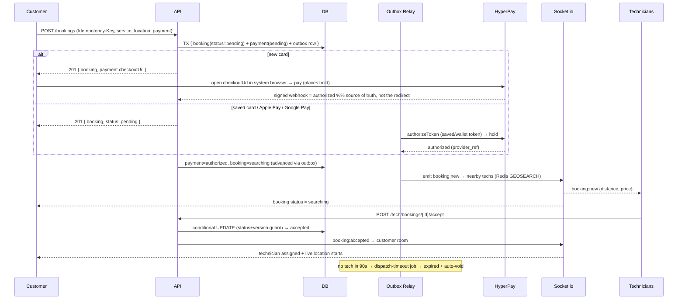

### 8.2 Technician Accept/Reject Flow

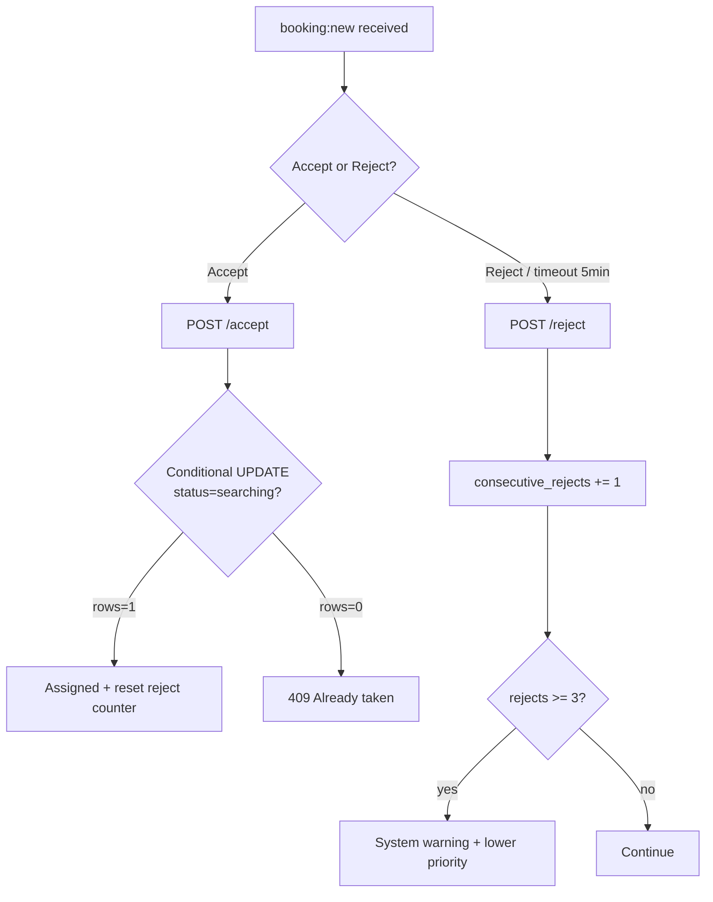

### 8.3 Payment Flow (pre-auth → capture → payout)

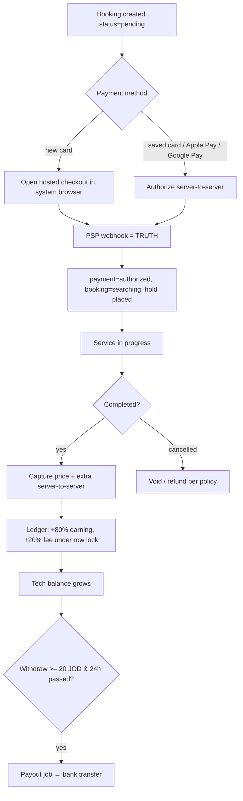

### 8.4 Guarantee Flow

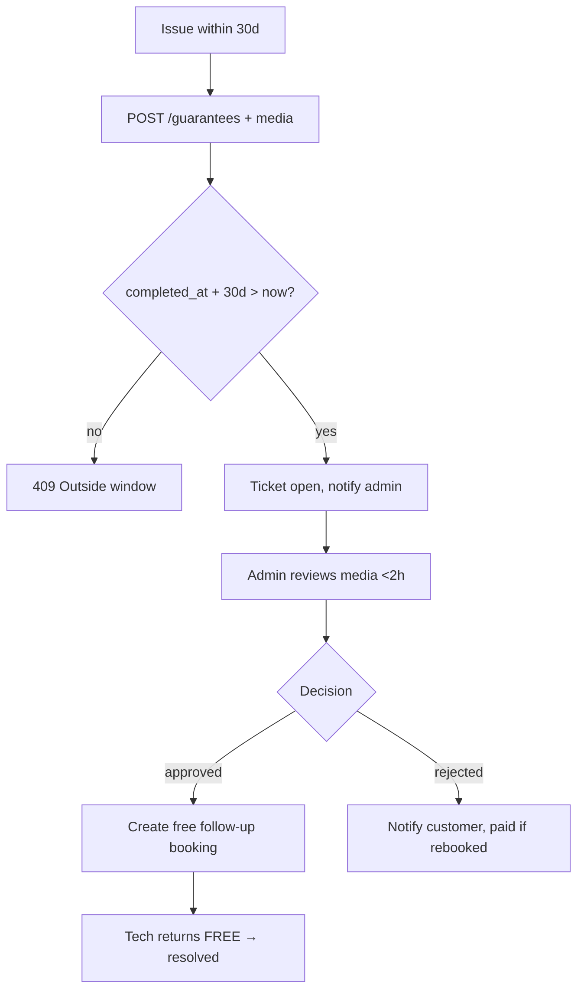

### 8.5 Real-Time Location Flow

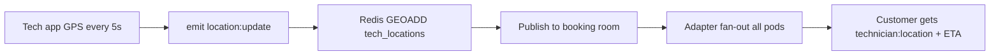

### 8.6 Notification Flow

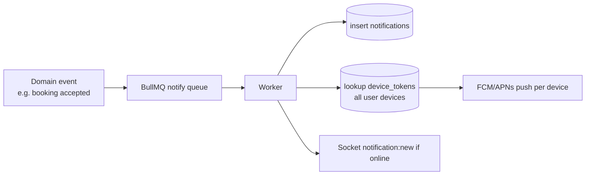

### 8.7 Extra-Work Approval (fixed-price integrity — §0.2 #3)

```mermaid
flowchart TD
    A[Tech finds bigger job than fixed price] --> B[POST /tech/bookings/{id}/extra amountFils+note]
    B --> C[extra_status=proposed + emit booking:extra_proposed]
    C --> D{Customer decides in-app}
    D -->|approve| E[extra_status=approved]
    D -->|decline| F[extra_status=declined]
    E --> G[On complete: capture price_fils + extra_fils]
    F --> H[Capture base price_fils ONLY<br/>or cancel per policy]
    G --> I[Promise intact — no silent charge]
    H --> I
```

### 8.8 Arrival SLA & Late Compensation (§0.3)

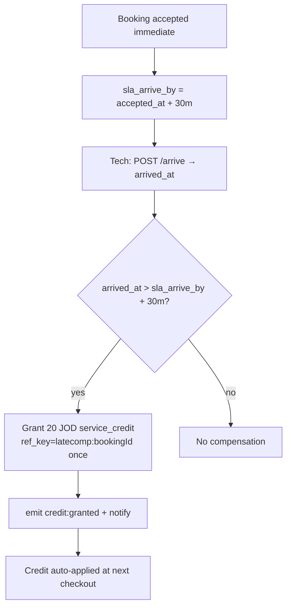

### 8.9 Video Pre-Check Quote (§0.3, Phase 2)

```mermaid
flowchart TD
    A[Customer uploads problem video] --> B[POST /quotes → status=pending]
    B --> C[Qualified tech/ops sets FIRM quoted_fils]
    C --> D[status=quoted + emit quote:ready]
    D --> E{Customer accepts before expiry?}
    E -->|yes| F[POST /quotes/{id}/accept → booking price_fils=quoted_fils]
    F --> G[Pay as normal → dispatch]
    E -->|no / expired| H[status=declined/expired]
```

### 8.10 Protection Subscription Lifecycle (§0.3, Phase 2)

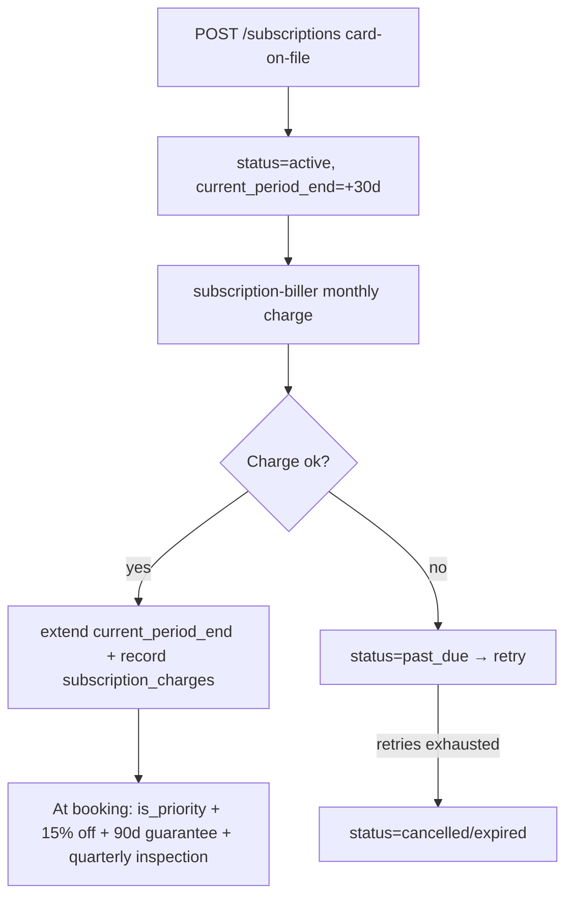

---

## 9. Infrastructure Design (lean MVP)

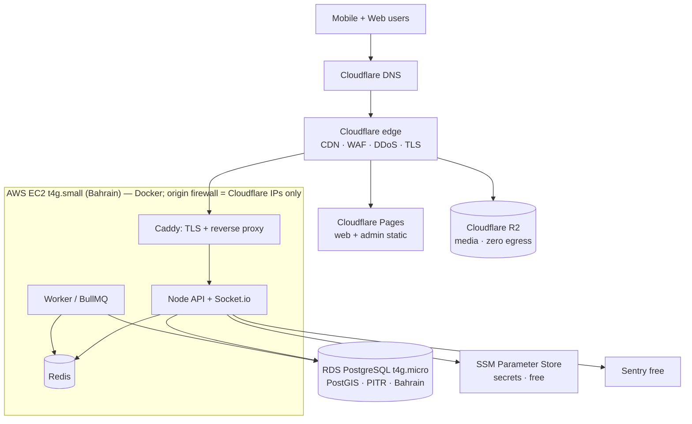

| Resource | MVP Spec | ~ $/mo |
|----------|----------|--------|
| Compute | 1× EC2 **t4g.small** (Graviton, 2GB, instance IAM role) — Docker: API+worker+Redis+Caddy | $12–18 |
| DB | RDS **db.t4g.micro** single-AZ, 20GB gp3, PostGIS, PITR | $13–18 |
| CDN/WAF/DNS/TLS | **Cloudflare free** | $0 |
| Web/admin hosting | **Cloudflare Pages** | $0 |
| Media storage | **Cloudflare R2** (zero egress) | $1–5 |
| Secrets | **SSM Parameter Store** (SecureString) | $0 |
| Errors / uptime | Sentry free + UptimeRobot free | $0 |
| Email/Slack alerts | SES / Slack webhook | ~$1 |
| **Infra subtotal** | | **~$30–45** |

**No ALB, no NAT Gateway, no ElastiCache, no CloudFront, no AWS WAF, no Secrets Manager, no Mongo** — each removed as not-needed-at-this-stage (all in §6 scale-up triggers).

**Origin access:** EC2 **instance IAM role** grants SSM Parameter Store + RDS access (no static keys — the reason EC2 is preferred over Lightsail). Security group allows **inbound only from Cloudflare IP ranges**. **Caddy TLS** via a Cloudflare **Origin CA cert** or ACME **DNS-01** (HTTP-01 fails behind the Cloudflare proxy).

**Backups/DR:** RDS automated backups + **PITR (7d)** + daily snapshot (35d). R2 versioning on media. Box is **cattle** (rebuildable from image + compose); Redis is cache (rebuildable). **RPO ≤ 5 min (PG), RTO ≤ 1 h.** Restore drill quarterly.

**R2 bucket layout:**
```
fixly-media/
  technician-docs/{userId}/...   (private, signed URL)
  guarantee/{ticketId}/...        (private, signed URL)
  reviews/{bookingId}/...         (public via Cloudflare)
```

---

## 10. Deployment Strategy

### 10.1 Backend CI/CD (GitHub Actions)

```yaml
name: backend-ci
on: { push: { branches: [main], paths: ['backend/**'] } }
jobs:
  test:
    runs-on: ubuntu-latest
    services:
      postgres: { image: postgis/postgis:15-3.4, env: { POSTGRES_PASSWORD: test }, ports: ['5432:5432'] }
      redis:    { image: redis:7, ports: ['6379:6379'] }
    steps:
      - uses: actions/checkout@v4
      - uses: actions/setup-node@v4
        with: { node-version: 20, cache: npm }
      - run: cd backend && npm ci
      - run: cd backend && npx prisma migrate deploy
      - run: cd backend && npm run lint && npm test
  deploy:
    needs: test
    runs-on: ubuntu-latest
    steps:
      - uses: actions/checkout@v4
      - name: Build + push image (GHCR, free)
        run: |
          echo "${{ secrets.GHCR_TOKEN }}" | docker login ghcr.io -u ${{ github.actor }} --password-stdin
          docker build -t ghcr.io/fixly/backend:${{ github.sha }} backend
          docker push ghcr.io/fixly/backend:${{ github.sha }}
      - name: Deploy to box over SSH
        uses: appleboy/ssh-action@v1
        with:
          host: ${{ secrets.BOX_HOST }}
          username: deploy
          key: ${{ secrets.BOX_SSH_KEY }}
          script: |
            cd /srv/fixly
            IMAGE_TAG=${{ github.sha }} docker compose pull backend
            docker compose run --rm backend npx prisma migrate deploy
            IMAGE_TAG=${{ github.sha }} docker compose up -d backend worker
```

> Use AWS region **`me-south-1` (Bahrain)** — lowest latency to Jordan among AWS regions.

### 10.2 Pipelines per platform
- **Web / Admin:** build (Vite) → **Cloudflare Pages** (git-connected auto-deploy + global CDN, free). No S3/CloudFront.
- **Mobile (one Skip codebase):** on a macOS runner — `skip export` transpiles → builds **both**: iOS (Fastlane → TestFlight → App Store) and Android (Gradle AAB → Play internal → production). **Build Android in RELEASE with ProGuard in CI** — the `ComposeView`/maps crash only surfaces in release.
- **Migrations:** `prisma migrate deploy` runs as ECS one-off task **before** service update. Expand-then-contract (backward-compatible) migrations only; never drop a column in the same release that stops writing it.

### 10.3 Environments
| Env | DB | Domain |
|-----|----|--------|
| development | local docker-compose | localhost |
| staging | shared box + RDS micro | staging-api.fixly.jo |
| production | box + RDS micro (Multi-AZ later) | api.fixly.jo |

`.env` keys (prod values in **SSM Parameter Store**): `DATABASE_URL`, `REDIS_URL`, `HYPERPAY_ENTITY_ID`, `HYPERPAY_TOKEN`, `HYPERPAY_WEBHOOK_SECRET`, `GOOGLE_MAPS_KEY_IOS`, `GOOGLE_MAPS_KEY_ANDROID`, `GOOGLE_MAPS_KEY_SERVER`, `WHATSAPP_PHONE_ID`, `WHATSAPP_TOKEN`, `SMS_FALLBACK_KEY`, `R2_ACCOUNT_ID`, `R2_ACCESS_KEY`, `R2_SECRET`, `R2_BUCKET`, `CLOUDFLARE_API_TOKEN`. **Loaded as files, not env vars:** `JWT_PRIVATE_KEY`/`JWT_PUBLIC_KEY` (PEM). (Firebase + AWS Secrets Manager removed.)

---

## 11. Performance Requirements

| Metric | Target | How achieved |
|--------|--------|--------------|
| API p95 latency | < 200 ms | edge cache, Redis cache, indexed queries, Prisma pool |
| DB query | < 50 ms | proper indexes, tuned Prisma pool (PgBouncer at scale), no N+1 |
| Location update e2e | < 1 s | Redis pub/sub + Socket.io adapter |
| Image upload | < 2 s | presigned direct-to-R2 (bypasses API) |
| App cold load | < 1 s | code-split, Cloudflare CDN, lazy routes |
| Nearby-tech query | < 50 ms | Redis GEO (in-memory) |
| Support first response | < 5 min | live chat + on-call rota |
| Guarantee response | < 2 h | admin SLA + priority queue |

Load target validated with **k6**: **50 RPS** sustained (≈10× Year-1 peak), p95 < 200ms. Re-test at higher targets only when real traffic approaches the ceiling — don't gold-plate for load you don't have.

---

## 12. Monitoring & Logging

- **Errors:** Sentry (free tier) — backend + mobile/Skip + web; release tracking, source maps. Watch Android **release** crashes (ProGuard + `ComposeView`).
- **Metrics/uptime:** Cloudflare Analytics (traffic, cache hit-rate — free) + UptimeRobot (health pings, free) + Sentry Performance (slow transactions). *(Self-host Prometheus/Grafana + distributed tracing = scale-up, not MVP.)*
- **Logs:** Pino JSON → box file → shipped to a free sink (Better Stack / Grafana Loki free tier). Correlation `requestId` per request, `bookingId` threaded through.
- **Product analytics:** **PostHog (free tier / self-hostable)** events (`signup`, `booking_created`, `booking_completed`, `repeat_booking`) — needed to measure the **70% retention** KPI.
- **Graceful shutdown:** on SIGTERM stop accepting new connections, drain in-flight HTTP, flush Socket.io rooms before exit. Prevents dropped websockets on deploy.
- **Health:** `GET /health` (liveness), `GET /health/ready` (checks PG + Redis). Caddy + UptimeRobot probe `/health`.
- **Alerts (Slack webhook + email, free):**
  - payment-success-rate < 95% (5 min) → page finance/on-call
  - p95 latency > 300ms (5 min)
  - error rate > 1%
  - no tech available in a zone > 10 min
  - RDS CPU > 80%, Redis evictions > 0
  - guarantee tickets breaching 2h SLA

---

## 13. Testing Strategy

| Level | Tool | Scope |
|-------|------|-------|
| Unit (backend) | **Jest** | services, money math, geo, fee calc, guarantee window logic |
| Integration | **Supertest** | full API routes against test PG/Redis |
| Contract | OpenAPI + **Dredd** | spec ↔ implementation parity |
| Mobile unit | **XCTest** (shared Swift) | view models, networking, money — runs once, covers both platforms |
| Mobile smoke | **Skip parity check** | build + run key screens on iOS sim AND Android emulator (release) |
| E2E web | **Playwright / React Testing Library** | booking flow happy path |
| Load | **k6** | 50 RPS, soak 30min (≈10× peak) |
| Security | **OWASP ZAP** + `npm audit` + Snyk | weekly + pre-release |

Critical test cases: double-accept race (version guard), refund-on-cancel policy, guarantee 30-day boundary (day 30 vs 31), payout min/24h gate, payment-capture idempotency (replay returns same result, no double charge), fixed-price snapshot immutability, **outbox exactly-once across a crash mid-relay**, **ledger balance == SUM(entries) under concurrent earnings**, dispatch-timeout auto-expire+void, pre-auth-expiry reconciler, multi-device push fan-out, **Skip Android release-build map render + moving marker (the ComposeView/ProGuard trap)**, payment webhook = source of truth (ignore spoofed redirect). **v1.5 business rules (§0):** extra-work gate — unapproved `extra_fils` is NEVER captured; late-compensation credit granted exactly-once (`ref_key`) only when `arrived_at > sla_arrive_by + 30m`; service-credit redemption capped at amount due (never negative charge); subscriber discount + `is_priority` applied at booking; probation-tier tech excluded from priority/wide-radius dispatch; upheld conduct report increments `off_platform_flags` and can demote tier; video quote → booking carries `price_fils = quoted_fils`; subscription revenue never posts to `ledger_entries`.

---

## 14. Cost Estimates (Monthly)

### Tier 0 — FREE ($0/mo · demo + early real users)
Host the **real** app for **$0** until you have traffic/revenue — every paid piece has a free tier.

| Item | Free option | $/mo |
|------|-------------|------|
| Compute + Postgres + Redis | **Oracle Cloud Always Free** ARM VM (up to 4 cores / 24 GB / 200 GB) — Docker runs API + worker + Postgres + Redis + Caddy on one box | $0 |
| CDN / DNS / TLS + web/admin hosting | **Cloudflare** free + **Pages** | $0 |
| Media storage | **Cloudflare R2** free (10 GB) | $0 |
| Maps | **MapLibre + OpenStreetMap** (no key); or Google Maps **$200/mo free credit** | $0 |
| OTP | mock (dev) / **WhatsApp Cloud API** free tier (~1k convos/mo) | $0 |
| Push · email · errors · uptime · analytics | FCM · Resend free · Sentry free · UptimeRobot free · PostHog free | $0 |
| **Tier 0 total** | | **$0** |

*No-server alt: **Neon** Postgres + **Upstash** Redis + **Render/Fly** free API + Cloudflare — all free tiers. Caveat: free API cold-starts and free DB pauses when idle (fine for demo, not 24/7 SLA). Oracle Always Free capacity can be region-limited at signup; fall back to this combo if so.*

> The only unavoidable costs are **deferred**: HyperPay (% per txn) begins when you take real payments; Apple/Google store fees when you publish. Until then the running app = **$0/mo**.

### Tier 1 — PAID (~$30–45/mo · when you outgrow free / want 24/7 SLA)

| Item | Est. Cost (USD) | Basis |
|------|-----------------|-------|
| EC2 **t4g.small** (Graviton) | $12–18 | API + worker + Redis + Caddy on one box |
| RDS **db.t4g.micro** single-AZ + 20GB | $13–18 | only managed piece (money DB + PITR) |
| Cloudflare (CDN/WAF/DNS/TLS/Pages) | $0 | free tier |
| Cloudflare R2 (media) | $1–5 | zero egress |
| SSM Parameter Store / Sentry / UptimeRobot / PostHog | $0 | free tiers |
| Email/Slack alerts (SES) | ~$1 | |
| **Fixed infra subtotal** | **~$30–45/mo** | down from ~$475–1,150 |
| Google Maps API | $30–150 | **map display via SDK = free**; only geocoding (cached) + 1 Directions call at accept |
| OTP — WhatsApp Cloud API + SMS fallback | $10–60 | WhatsApp auth msgs cheap; SMS only on fallback |
| Call masking (Twilio proxy, optional) | $0–40 | or in-app VoIP / deferred |
| HyperPay (PSP) | ~2.5–2.9% + ~$0.30/txn | pass-through per transaction |
| **Total fixed (excl. PSP %)** | **~$70–255/mo** | first 6 months |

> Maps is the main variable — slashed by using the **free mobile SDK for display** (no Static-Maps / per-load tiles), **caching geocoding** results, and calling **Directions once at accept** (ETA between ticks = straight-line distance ÷ avg speed, or self-hosted OSRM on the box). Restrict map API keys by bundle ID / referrer + daily quota caps.

---

## 15. Code Templates

### 15.1 Backend — Booking creation (Express + Prisma + Zod)

```typescript
// backend/src/interface/http/booking.controller.ts  (delivery layer → calls a use case)
import { Router } from 'express';
import { z } from 'zod';
import { requireAuth } from '../middleware/auth';
import { idempotent } from '../middleware/idempotency';
import { CreateBooking } from '../../application/booking/CreateBooking';

const router = Router();

const CreateBookingDto = z.object({
  serviceId: z.string().uuid(),
  type: z.enum(['immediate', 'scheduled']),
  scheduledAt: z.string().datetime().optional(),
  location: z.object({ lat: z.number(), lng: z.number() }),
  addressText: z.string().min(3).max(500),
  notes: z.string().max(500).optional(),
  payment: z.object({                          // new card -> hosted checkout; token -> repeat/wallet
    method: z.enum(['card', 'applepay', 'googlepay']).default('card'),
    savedToken: z.string().optional(),
    walletToken: z.string().optional(),
  }),
});

router.post('/bookings', requireAuth('customer'), idempotent, async (req, res, next) => {
  try {
    const dto = CreateBookingDto.parse(req.body);
    const key = req.header('Idempotency-Key');
    if (!key) throw new ValidationError('Idempotency-Key header required'); // a random key per retry = no dedupe
    const booking = await CreateBooking.exec(req.user.id, dto, key);
    res.status(201).json({ success: true, data: booking });
  } catch (err) { next(err); }
});

export default router;
```

```typescript
// backend/src/application/booking/CreateBooking.ts  (USE CASE — depends only on domain ports)
// OUTBOX pattern: NO external call in the request path. Booking + payment + outbox row
// commit atomically; the outbox-relay worker authorizes payment + emits booking:new.
// Fixes the dual-write hole (crash between PSP auth and DB commit = orphaned hold).
import { prisma } from '../../infrastructure/config/db';
import { genRefCode } from '../../domain/booking/ref';

export const CreateBooking = {
  async exec(customerId: string, dto: CreateBookingDto, idempotencyKey: string) {
    return prisma.$transaction(async (tx) => {
      const service = await tx.service.findUniqueOrThrow({ where: { id: dto.serviceId } });

      const b = await tx.booking.create({
        data: {
          refCode: genRefCode(),
          customerId,
          serviceId: dto.serviceId,
          type: dto.type,
          scheduledAt: dto.scheduledAt,
          status: 'pending',                       // -> 'searching' after auth succeeds
          priceFils: service.basePriceFils,
          platformFeeFils: Math.round(service.basePriceFils * 0.2),
          addressText: dto.addressText,
          notes: dto.notes,
        },
      });
      await tx.$executeRaw`UPDATE bookings SET location =
        ST_SetSRID(ST_MakePoint(${dto.location.lng}, ${dto.location.lat}),4326) WHERE id = ${b.id}::uuid`;

      await tx.payment.create({
        data: { bookingId: b.id, provider: 'hyperpay', status: 'pending',
                amountFils: service.basePriceFils },
      });

      // Same-tx outbox row => relay creates hosted checkout OR authorizes saved/wallet token.
      await tx.outboxEvent.create({
        data: {
          aggregate: 'booking', aggregateId: b.id, eventType: 'booking.created',
          payload: { bookingId: b.id, payment: dto.payment, idempotencyKey },
        },
      });
      // New-card path: relay returns checkoutUrl (surfaced via booking:status / GET booking).
      return b; // status=pending; client subscribes to booking:status (+ opens checkoutUrl if present)
    });
  },
};
```

```typescript
// backend/src/jobs/outbox-relay.ts — repeatable ~1s; SKIP LOCKED for safe concurrency
export async function relayOnce() {
  const rows = await prisma.$queryRaw<OutboxRow[]>`
    UPDATE outbox_events SET status='processing'
    WHERE id IN (SELECT id FROM outbox_events
                 WHERE status IN ('pending','failed') AND next_retry_at <= now()
                 ORDER BY id FOR UPDATE SKIP LOCKED LIMIT 50)
    RETURNING *`;
  for (const ev of rows) {
    try {
      await handlers[ev.event_type](ev.payload);          // e.g. authorize hold + emit booking:new
      await prisma.outboxEvent.update({ where: { id: ev.id }, data: { status: 'done' } });
    } catch (e) {
      await prisma.outboxEvent.update({ where: { id: ev.id },
        data: { status: 'failed', attempts: { increment: 1 }, nextRetryAt: backoff(ev.attempts) } });
      // after N attempts -> dead-letter + alert
    }
  }
}
```

```typescript
// domain/payment/payment.port.ts (interface) + infrastructure/payment/HyperPayProvider.ts (impl)
export interface PaymentProvider {
  createCheckout(p: { amountFils: number; currency: 'JOD'; paymentType: 'PA'; returnUrl: string })
    : Promise<{ checkoutId: string; redirectUrl: string }>;           // hosted page (new card)
  authorizeToken(p: { amountFils: number; token: string })           // saved card OR wallet token
    : Promise<{ ref: string }>;
  capture(p: { ref: string; amountFils: number }): Promise<void>;
  refund(p: { ref: string; amountFils: number }): Promise<void>;
  void(p: { ref: string }): Promise<void>;
  verifyWebhook(rawBody: Buffer, signature: string): boolean;        // signed callback = truth
}
export const payments: PaymentProvider = new HyperPayProvider();

// domain/otp/otp.port.ts (interface) + infrastructure/otp/* (impls)
// Code is generated + hashed in Redis by the VerifyOtp use case; providers only DELIVER.
export interface OtpProvider { send(p: { phone: string; code: string }): Promise<void>; }
// Primary = WhatsApp Cloud API (cheap); fallback = SMS (Twilio / local aggregator).
export const otp: OtpProvider = new FallbackChain([
  new WhatsAppCloudProvider(),
  new SmsProvider(/* Twilio or Unifonic/Infobip */),
]);
```

### 15.2 Mobile (Skip) — Clean Architecture (Presentation → Domain → Data)

ViewModel depends on **Domain use cases (protocols)**, never on the network — keeps it testable and Skip-portable. Use-case impls live in the Data layer and call `APIClient`.

```swift
// Presentation/Booking/BookingViewModel.swift — depends on DOMAIN use cases, not on networking.
import Foundation
import CoreLocation

@MainActor
final class BookingViewModel: ObservableObject {
    @Published var services: [Service] = []
    @Published var selectedService: Service?
    @Published var isLoading = false
    @Published var errorMessage: String?

    private let loadServices: LoadServicesUseCase     // injected (DI), defined in Domain
    private let createBooking: CreateBookingUseCase

    init(loadServices: LoadServicesUseCase, createBooking: CreateBookingUseCase) {
        self.loadServices = loadServices; self.createBooking = createBooking
    }

    func onAppear() async {
        isLoading = true; defer { isLoading = false }
        do { services = try await loadServices() }
        catch { errorMessage = error.localizedDescription }
    }

    func book(at coord: CLLocationCoordinate2D, address: String,
              notes: String?, method: PaymentMethod) async -> BookingResult? {
        guard let service = selectedService else { return nil }
        do { return try await createBooking(.init(service: service, coord: coord,
                                                  address: address, notes: notes, method: method)) }
        catch { errorMessage = error.localizedDescription; return nil }
    }
}

// Domain/Booking/UseCases.swift — ports (no implementation here)
protocol LoadServicesUseCase { func callAsFunction() async throws -> [Service] }
protocol CreateBookingUseCase { func callAsFunction(_ input: NewBooking) async throws -> BookingResult }

// Data/Booking/BookingRepository.swift — impl calls APIClient (URLSession) + caches.
// On a returned checkoutUrl: open in SFSafariViewController (system browser) —
// never an embedded WebView (wallets + 3DS + PCI SAQ-A).
```

```swift
// mobile/Sources/Fixly/Features/Booking/Views/ServiceListView.swift
import SwiftUI

struct ServiceListView: View {
    @StateObject private var vm = BookingViewModel()
    var body: some View {
        NavigationStack {
            List(vm.services) { service in
                NavigationLink(value: service) {
                    HStack {
                        AsyncImage(url: URL(string: service.iconUrl)) { $0.resizable() }
                            placeholder: { ProgressView() }
                            .frame(width: 44, height: 44)
                        VStack(alignment: .leading) {
                            Text(service.nameAr).font(.headline)
                            Text("\(service.basePriceFils / 1000) دينار").foregroundStyle(.secondary)
                        }
                    }
                }
            }
            .navigationTitle("اختر الخدمة")
            // RTL comes from app localization (Localizable ar) + system locale,
            // NOT a hardcoded override — hardcoding .rightToLeft breaks the English build.
            .task { await vm.loadServices() }
        }
    }
}
```

### 15.3 Mobile (Skip) — Google Maps on BOTH platforms (the hard part)

**Google Maps both sides** (no Apple Maps) for identical behavior + styling: iOS uses the **Google Maps SDK** (`GMSMapView` via `UIViewRepresentable`), Android uses **Google Maps Compose** via Skip's `ComposeView`. One shared Swift `TechMapView`; business logic written once.

```swift
// mobile/Sources/Fixly/Platform/GoogleMap.ios.swift  (iOS — Google Maps SDK)
import SwiftUI
import GoogleMaps                                // pod 'GoogleMaps'

struct GoogleMapIOS: UIViewRepresentable {
    let lat: Double; let lng: Double
    func makeUIView(context: Context) -> GMSMapView {
        let v = GMSMapView(); v.camera = .camera(withLatitude: lat, longitude: lng, zoom: 15); return v
    }
    func updateUIView(_ map: GMSMapView, context: Context) {
        map.clear()
        let m = GMSMarker(position: .init(latitude: lat, longitude: lng))
        m.title = "Technician"; m.map = map
        map.animate(toLocation: .init(latitude: lat, longitude: lng))   // smooth marker move on socket tick
    }
}

struct TechMapView: View {                        // shared surface
    let lat: Double; let lng: Double
    var body: some View {
        #if SKIP
        ComposeView { ctx in GoogleMapAndroid(lat: lat, lng: lng, ctx: ctx) }
        #else
        GoogleMapIOS(lat: lat, lng: lng)
        #endif
    }
}
```
```kotlin
// mobile/Sources/Fixly/Platform/GoogleMap.android.kt  (Android — Google Maps Compose)
// Skip/skip.yml gradle dep: com.google.maps.android:maps-compose:6.x
@Composable fun GoogleMapAndroid(lat: Double, lng: Double, ctx: ComposeContext) {
    val pos = LatLng(lat, lng)
    val cam = rememberCameraPositionState { position = CameraPosition.fromLatLngZoom(pos, 15f) }
    GoogleMap(cameraPositionState = cam) { Marker(state = MarkerState(position = pos), title = "Technician") }
}
```
> ⚠️ Map **display via the mobile SDK is free** (no per-load tile cost) — keep ETA/Directions API calls minimal (once at accept). **Validate in a RELEASE Android build with ProGuard ON** — `ComposeView`/maps is the documented release-only crash spot (needs `proguard-rules.pro` keep rules). This is the Skip go/no-go gate (appendix).

### 15.4 Web — RTK Query slice (React + TS)

```typescript
// frontend-web/src/store/api.ts
import { createApi, fetchBaseQuery } from '@reduxjs/toolkit/query/react';

export const api = createApi({
  reducerPath: 'api',
  baseQuery: fetchBaseQuery({
    baseUrl: import.meta.env.VITE_API_URL,
    credentials: 'include',                 // send HttpOnly refresh cookie to /auth/refresh
    prepareHeaders: (headers) => {
      // access token kept in memory (module/redux state), NEVER localStorage (XSS-safe)
      const token = getAccessTokenFromMemory();
      if (token) headers.set('Authorization', `Bearer ${token}`);
      return headers;
    },
  }),
  tagTypes: ['Booking'],
  endpoints: (b) => ({
    getServices: b.query<Service[], void>({ query: () => '/services',
      transformResponse: (r: ApiResponse<Service[]>) => r.data }),
    createBooking: b.mutation<Booking, CreateBookingDto>({
      query: (body) => ({ url: '/bookings', method: 'POST', body }),
      invalidatesTags: ['Booking'],
    }),
  }),
});
export const { useGetServicesQuery, useCreateBookingMutation } = api;
```

### 15.5 Realtime — Socket.io server with Redis adapter + JWT auth

```typescript
// backend/src/realtime/index.ts
import { Server } from 'socket.io';
import { createAdapter } from '@socket.io/redis-adapter';
import { pubClient, subClient } from '../config/redis';
import { verifyAccessToken } from '../modules/auth/jwt';

export function initRealtime(httpServer) {
  const io = new Server(httpServer, { cors: { origin: ALLOWLIST } });
  io.adapter(createAdapter(pubClient, subClient));

  io.use((socket, next) => {
    try {
      const { token } = socket.handshake.auth;
      socket.data.user = verifyAccessToken(token);
      next();
    } catch { next(new Error('UNAUTHENTICATED')); }
  });

  io.on('connection', (socket) => {
    const { id, role } = socket.data.user;
    socket.join(role === 'technician' ? `tech:${id}` : `user:${id}`);

    socket.on('location:update', async ({ lat, lng }) => {
      await pubClient.geoAdd('tech_locations', { member: id, longitude: lng, latitude: lat });
      const bookingId = await getActiveBooking(id);
      if (bookingId) io.to(`booking:${bookingId}`).emit('technician:location', { bookingId, lat, lng });
    });
  });

  return io;
}
```

### 15.6 docker-compose (local dev)

```yaml
# docker/docker-compose.yml  (local dev; prod compose adds caddy, no mongo)
version: '3.9'
services:
  postgres:
    image: postgis/postgis:15-3.4
    environment: { POSTGRES_DB: fixly, POSTGRES_PASSWORD: dev }
    ports: ['5432:5432']
    volumes: ['./postgres/init.sql:/docker-entrypoint-initdb.d/init.sql']
  redis:
    image: redis:7
    ports: ['6379:6379']
  backend:
    build: ../backend
    env_file: ../backend/.env
    ports: ['4000:4000']
    depends_on: [postgres, redis]
  worker:
    build: ../backend
    command: node dist/infrastructure/queue/worker.js
    env_file: ../backend/.env
    depends_on: [postgres, redis]
```

---

## 16. Local Development (Free Tier) — run the whole app for $0

Goal: see all 4 apps working end-to-end **before** any paid contract or store account. Every production dependency has a free local stand-in, wired behind the same `PaymentProvider` / `OtpProvider` / storage / map interfaces — so going to production later is a **config flip, not a rewrite**.

| Production (paid / contract) | Free local dev replacement | Account needed? |
|------------------------------|----------------------------|-----------------|
| AWS RDS PostgreSQL | `postgis/postgis:15` in Docker | none |
| ElastiCache Redis | `redis:7` in Docker | none |
| Cloudflare R2 / S3 media | **MinIO** (S3-compatible) in Docker | none |
| HyperPay payments | **MockPaymentProvider** (auto authorize/capture, returns a fake `checkoutUrl` that succeeds); optional **Stripe test mode** for realism | none / free |
| WhatsApp Cloud API + SMS OTP | **MockOtpProvider** — prints the code to the server console; verify accepts dev code `000000` | none |
| Google Maps (display + geocode) | **MapLibre GL + OpenStreetMap** tiles (no key) + **Nominatim** geocoding | none |
| FCM / APNs push | in-app **Socket.io** notifications only for the demo (FCM later — free tier) | none |
| Cloudflare CDN/WAF, SSM secrets | Vite dev server + local `.env` file | none |
| Sentry / monitoring | Pino pretty → console | none |

**Switch via env:** `ENV=local` selects the mock/free providers; `ENV=production` selects HyperPay / WhatsApp / Google Maps / R2. The interfaces (`PaymentProvider`, `OtpProvider`, storage, `MapProvider`) already exist (§15.1) — only the concrete implementation swaps. No business-logic changes.

**Fastest path to SEE a full working app:** run **backend + web app** in the browser — zero device or store accounts. The **mobile (Skip)** app runs on the iOS Simulator / Android Emulator with only the **free** Xcode + Android Studio (no paid Apple/Google account needed until you ship to stores).

> When you later sign HyperPay / Apple / Google Play, flip the four providers from mock → real and add keys to SSM. Nothing else changes.

---

## 17. MVP Operating Model — Business & Operations Requirements

> **Read this first.** §1–§16 specify the *software*. This section specifies the *business the software runs*. The correct mental model is **not "build an app that works" but "build a micro-operating-system for home maintenance in Amman."** The market does not reward the prettiest UI — it rewards whoever turns an unorganized, low-trust service into a reliable, controlled experience (this is exactly what separated managed marketplaces like Urban Company from simple directories). Every requirement below is either **MVP** (ship at launch) or **Phase 2** (built-but-gated / after quality is proven), and is mapped to the concrete system that implements it.

### 17.1 What the customer must notice immediately (the brand's 4 pillars)

A "near-perfect" MVP makes four things obvious to the customer from the first booking. If any is missing, Fixly is just another directory app.

1. **Fixed, transparent pricing** — the price is shown and locked *before* confirmation; increases require in-app approval (§0.2 #3, §17.5).
2. **Fixly Certified technicians** — vetted, badged, name/photo/rating shown **before** arrival (§17.3).
3. **A 30-day structured guarantee** — a real, operational warranty with a 2-hour response SLA, not a marketing line (§8.4, guarantee state machine).
4. **Fast support + a fully digital flow** — 24/7 Arabic human support (first response ≤ 5 min) and payment that never touches cash-to-technician (§17.9, §5 PCI).

**Customer-visible experience requirements (MVP):** technician name + photo + rating before arrival · clear ETA · live order-status updates · support reachable from the order screen · simple invoice summary / e-receipt · one-tap rebooking · a tidy order & maintenance history.

**Technician-visible experience requirements (so good technicians stay — §0.2 #2):** a simple, fast app · **expected earnings shown per offered job** · transparent payout + timing · a fair SLA · protection from abusive customers (`conduct_reports` cut both ways) · a **scorecard the technician can see and understand** · incentives that reward **quality and reliability, not just volume**.

### 17.2 Core service engines (the MVP "engine room")

The platform is six cooperating engines. Most already exist in code (§ references); this table is the authoritative spec of what each must do and where it lives.

| Engine | Responsibility | Inputs → Output | Implementation status |
|--------|----------------|------------------|-----------------------|
| **Matching** | Offer a job to the right technicians | zone + specialty + availability + trust tier + distance → ranked offer set | **Built** — `DispatchService` (Redis GEO nearby, per-service filter, probation radius cap §0.2 #1); broadcast-and-accept rounds with timeout expansion (§8.2) |
| **Pricing** | Compute the amount due | service fixed-scope price + optional callout fee + approved add-ons − promo − subscription − wallet credit → `totalJod` | **Built (core)** — `BookingService.createBooking` + `PromoService` + credit redemption; **callout fee + package pricing = §17.5 (to add)** |
| **Quality** | Score technicians continuously | rating + lateness + **redo/warranty rate** + **complaint rate** + upheld conduct flags → `trustTier` | **Partial** — `TrustService` recompute uses rating/volume/flags; **redo-rate + complaint-rate inputs = §17.7 (to add)** |
| **Warranty** | Link a claim to its original job and govern the outcome | completed booking + within window → guarantee ticket → free re-visit / refund | **Built** — `GuaranteeService` state machine (open → under_review → approved/rejected → resolved), 30-day (90 for subscribers), 2-hour SLA (§8.4) |
| **Fraud / Leakage** | Detect off-platform and abnormal patterns | conduct reports + behavioural signals → flags / tier demotion / suspension | **Partial** — `conduct_reports` + `offPlatformFlags` + auto-suspend; **automated pattern detection = Phase 2** |
| **Notification** | Reach the right party on the right channel | domain event → Push / in-app / (SMS·WhatsApp fallback) | **Built** — outbox → `NotificationService` + `device_tokens` + Socket.io (§8.6) |

### 17.3 Fixly Certified — technician certification & onboarding program

Vetting is more important than any screen (existential risk #1 + #3). The MVP ships a **real certification pipeline**, even in a lightweight form. Document-screening alone is explicitly *not* sufficient.

**Certification pipeline (gate to `APPROVED` + `trustTier=VERIFIED`):**

| Stage | What happens | System hook |
|-------|--------------|-------------|
| 1. KYC + identity | National ID captured (stored encrypted, `national_id_enc` §2.2) + selfie match | onboarding docs (`idDocUrl`, `selfieUrl`) |
| 2. Professional docs | Trade certificate / references uploaded and reviewed | `certificateUrl`; admin review |
| 3. Short interview | Ops screens attitude, Arabic communication, reliability | Ops Console note (§17.6) |
| 4. Practical / video test | Skills demonstrated (in person or by video) → pass recorded | `skillsTestPassedAt` (§2.2) |
| 5. SOP onboarding | Technician trained on the service SOPs + app + conduct rules | onboarding checklist (Ops) |
| 6. Background check | Result recorded | `bgCheckStatus` (PENDING → PASSED/FAILED) |
| 7. **Probation — first 10 orders** | Tighter dispatch radius, closer monitoring, faster suspension on a valid complaint | `trustTier=PROBATION` + `PROBATION_MAX_RADIUS_KM` (§0.2 #1). *Threshold currently first-N by tier policy; the explicit "10-order graduation" rule is the MVP target for `TrustService`.* |
| 8. Continuous re-evaluation | Nightly recompute; tier can rise or fall; repeat off-platform flags auto-suspend | `trustService.recomputeAll()` job |

**Program parameters to decide before onboarding technicians (open items, surface as NEEDS CONTEXT):** training **duration**, **who** delivers it and **where**, **content** curriculum, how the **practical exam** is administered and scored, **who pays** the training cost, and the exact mapping from exam score → badge/tier. **Formal training + insurance are Phase 2**; the data model already carries `isInsured` and the tier machinery so turning them on is configuration, not a rewrite. **Watch-item:** until formal training exists, quality is enforced *after the fact* (post-complaint filtering), so if the early complaint rate is high the 30-day guarantee can become the platform's biggest cost — monitor guarantee-claim + dispute rate from booking #1 (§0.4, §17.10).

### 17.4 Service SOPs (Standard Operating Procedures) + service scopes

Every service must have a written SOP. SOPs protect the customer (no surprises), the technician (clear boundary), and the guarantee (clear "was this in scope?").

**Each service SOP defines:** the **scope description** · **what the price includes** · **what it explicitly does NOT include** · a **pre-start checklist** · a **pre-close checklist** · **before/after photos** when relevant · **escalation cases** · **the exact trigger for "extra work"** (which routes into the approval gate §0.2 #3).

**Data requirement — `service_scopes` (MVP target, not yet in schema):** a per-service structured scope record (`service_id`, `includes[]`, `excludes[]`, `preStartChecklist[]`, `preCloseChecklist[]`, `photosRequired` bool, `extraWorkTriggers[]`). Until modeled, SOPs live as ops documents referenced by the service; the schema addition is a small additive migration when built.

### 17.5 Pricing model — fixed-scope, not naïvely flat

A flat "any job = one price" is an operational trap. The promise the customer feels is **transparency**, delivered via **fixed-scope** pricing:

- **Fixed-scope package price** per common job type (the `services.base_price_fils` catalogue is the v1 of this; package variants are the MVP target).
- **Callout / inspection fee** — a clear, disclosed fee for diagnosis/visit, so complex jobs don't lose money and the technician's trip is never free. *(New field target: `services.callout_fee_fils`; disclosed before confirmation.)*
- **Governed add-ons** — any additional work is proposed by the technician and **must be approved in-app by the customer before it can be billed** — already enforced end-to-end via `AdditionalWorkItem` + the capture gate (§0.2 #3, §8.7). Unapproved extra is **never** captured.

This keeps the "no surprises" promise while staying solvent on hard jobs. Margin-per-service is tracked in the economics KPIs (§17.10).

### 17.6 Ops Console (operations layer — not a cosmetic admin panel)

The MVP must include a real **operations console** — the screen an operator uses to run the city day-to-day. Without it, you cannot see where the system breaks. Beyond the CRUD admin already built (§7 `admin/`), the Ops Console must surface:

- **Open orders** (live, by status) and **available technicians** (live map/list).
- **Late orders** — arrival past SLA (drives late-compensation, §8.8) and stuck orders.
- **High-risk orders** — new-customer + probation-tech, high value, prior complaint.
- **Cancellations** — with reason, and **no-show** tracking.
- **Complaints & guarantee queue** — the 2-hour SLA queue (§8.4) + complaint taxonomy (§17.7).
- **Per-technician daily performance** — the scorecard (rating, lateness, redo, complaints, acceptance).

*Status:* the admin app already covers technicians, bookings, guarantee, conduct reports, subscriptions, quality board, quotes, payouts, reports (§7). The **"late / high-risk / daily-performance" operational views** are the MVP target additions.

### 17.7 Data-model additions for operations (current vs target)

Everything must leave an **event trail** — you cannot fix what you cannot see. Current implementation vs target:

| Concept | Target requirement | Current implementation | Gap / action |
|--------|--------------------|------------------------|--------------|
| **Order events** | Immutable log of every state change: created, accepted, arrived, started, finished, complained, warranty-returned | `booking_status_history` (from/to/actor/meta/ts) + `arrivedAt`/`startedAt`/`completedAt` timestamps | Broaden history coverage to include complaint + warranty-return events; keep append-only |
| **Zones** | Named dispatch zones (North/Central Amman) for matching + reporting | Radius-based dispatch (Redis GEO) | Add `zones` + tag bookings/techs with zone (MVP-target refinement; radius works for launch) |
| **Availability slots** | Technician bookable time slots for scheduled jobs | `scheduledAt` on booking + `isAvailable` toggle | Add `availability_slots` when scheduled-booking depth increases (Phase 2) |
| **Complaints + taxonomy** | Categorized complaints (quality / lateness / pricing / conduct / safety / other) | `support_tickets` + `conduct_reports` | Add a `category` enum + link to booking; feeds Quality engine complaint-rate |
| **Technician scorecard** | Rating + lateness + **redo/warranty rate** + **complaint rate** + acceptance | `rating`, `jobsCompleted`, `offPlatformFlags`, `consecutive_rejects` | Add redo-rate + complaint-rate aggregates (feeds §17.2 Quality engine) |
| **Warranty ↔ original order** | Every warranty ticket links to the job it covers + optional free follow-up | `guarantee_tickets.bookingId` + `followup_booking_id` | **Done** |

These are additive migrations; none block launch, but each is specified so the build order is unambiguous.

### 17.8 Operating policies (part of the UX, not just legal fine print)

Nine policies must exist from day one and be enforced by the system where possible:

| Policy | Rule (MVP default — confirm before launch) | System enforcement |
|--------|--------------------------------------------|--------------------|
| **Cancellation** | Free before dispatch/accept; fee window after a technician is en route | `cancel()` transition guards; fee logic = MVP target |
| **No-show (customer)** | Technician marks no-show; callout fee may apply | Ops + `conduct_reports` (`NO_SHOW`) |
| **Late arrival** | Technician >30 min past SLA → automatic 20 JOD customer credit | **Done** — `service_credits` `LATE_COMPENSATION`, exactly-once (§8.8) |
| **Extra-work approval** | No unapproved charge, ever | **Done** — `AdditionalWorkItem` + capture gate (§0.2 #3) |
| **Refund** | Instant, no-argument refund when the customer is not satisfied within guarantee | `GuaranteeService` + PSP refund/void (§8.3, §8.4) |
| **Warranty** | 30 days (90 for subscribers); free re-visit if in scope | **Done** — `GuaranteeService` |
| **Technician misconduct** | Upheld conduct report → flag → tier demotion → suspension | **Done** — `conduct_reports` resolve → `offPlatformFlags` → auto-suspend |
| **Customer abuse** | Repeated abuse/fraud → block; protects technicians | `users.isActive=false` (admin block) + conduct reports |
| **Off-platform** | Soliciting off-platform is a violation; guarantee/credit/subscription valid **only** for on-platform jobs | Masked calling + `conduct_reports` (`OFF_PLATFORM_SOLICIT`) (§0.2 #2) |

### 17.9 Support operations

Support is **not optional** in a trust business. MVP support requires: canned **macros** for the common cases · a **decision tree** for complaints · problem **categorization** (feeds the taxonomy §17.7) · an **escalation matrix** (who handles what, when) · and explicit **SLAs — first response ≤ 5 minutes, guarantee decision ≤ 2 hours** (the guarantee SLA is already enforced by `guarantee_tickets.expiresAt`, §8.4). Channels: in-app support thread (built, § `support`), with masked call + WhatsApp deep-link as the human path (full in-app chat is Phase 2).

### 17.10 Week-1 product KPIs (do not launch without this dashboard)

Instrumented via PostHog + backend metrics (§12). If you can't measure it, you can't improve it.

| KPI | Why | Early target (Amman) |
|-----|-----|----------------------|
| App-open → booking conversion | Funnel health | trend up |
| Technician acceptance rate | Supply liquidity | ≥ 70% |
| Avg time-to-assign | Speed promise | < 5 min |
| Avg arrival delay | SLA + late-comp cost | < 10 min |
| Completion rate | Reliability | ≥ 95% |
| Cancellation rate | Friction / supply gaps | < 10% |
| **Complaint rate** | Quality (guarantee-cost leading indicator) | < 5% |
| **Warranty / redo rate** | Quality + guarantee cost | < 5% |
| **Repeat booking rate** | Retention (the Year-1 north star, §0.4) | ≥ 30% at 60 days |
| Orders per active technician | Supply efficiency | trend up |
| On-platform repeat rate | Anti-leakage effectiveness (§0.2 #2) | high |
| NPS / CSAT | Overall trust | ≥ 50 NPS |

### 17.11 Operating team (the business around the app)

Even with heavy AI-assisted build, the venture needs an operating team — in this business the ops team matters nearly as much as the tech team:

- **Founder / PM** — owns operations end-to-end.
- **Ops lead** — runs the Ops Console, dispatch exceptions, daily performance.
- **QA / Support hybrid** — complaints, macros, guarantee SLA.
- **Technician onboarding manager** (even part-time) — certification pipeline (§17.3).
- **Part-time legal / accounting** — contracts, payouts, compliance (§17.15).

(This is distinct from the *engineering* team split in the Appendix. **Design-review note:** an external review flagged that this system design is senior/staff-level — hexagonal architecture, outbox, optimistic locking, geo-dispatch, Skip transpiler — so at least one experienced engineer is needed to hit the 14-week target with quality.)

### 17.12 Go-to-market & the chicken-and-egg problem

Not a technical section, but a launch-blocking requirement — the system does not solve supply/demand bootstrapping by itself.

- **Seed supply first, tightly:** recruit and certify **100–200 trusted technicians** in the 3 launch categories before demand marketing (§0.1 competitor data shows the local supply is under-served).
- **First 100–500 customers:** partnerships with **property-management companies / residential compounds**, targeted digital campaigns in North/Central Amman, and **technician-driven + customer referral** (referral credit funded via `service_credits`).
- **Two pitches:** to customers — *"fixed price, certified technician, real guarantee, 24/7."* To technicians — *"more, better-paying, reliable jobs; you get paid on time; we protect you from bad customers."*
- **CAC guardrail:** target customer-acquisition cost ~5–15 JOD (§0.1); rely on word-of-mouth from the guarantee promise to lower it over time.

### 17.13 12-month Amman operational plan (phased, with KPI gates)

Expansion is **gated on quality**, never on calendar alone.

| Phase | Window | Scope | Gate to advance |
|-------|--------|-------|-----------------|
| **0. Pilot** | Months 1–2 | 1–2 Amman districts, 3 categories, ~20–30 certified technicians | complaint rate < 5%, completion ≥ 95%, guarantee cost contained |
| **1. Amman rollout** | Months 3–6 | All North + Central Amman | repeat-booking ≥ 30% @ 60d, acceptance ≥ 70%, NPS ≥ 50 |
| **2. Category expansion** | Months 6–9 | Add Painting + Furniture (already seeded) | per-category complaint/redo rate within target before switching each on |
| **3. Depth + loyalty** | Months 9–12 | Turn on Protection subscription + video pre-check (Phase-2 features, already built); iOS depth | MRR from subscription trending; unit economics positive per service |

### 17.14 Regional expansion (high-level, post-Amman)

Designed geographically-neutral (money as integer minor units; no Amman-hardcoding in domain), but **no market is entered until Amman's model is proven**. Per-country entry checklist (high-level): local **PSP** (HyperPay covers KSA/UAE; per-market contract), **labor-law / contractor** rules, **pricing** recalibration, **Arabic dialect / UX** tuning, local **technician supply** seeding, and a **payments/tax** setup. Priority candidate: **KSA** (largest adjacent market, HyperPay/mada supported). This is a **Phase-3+** concern — captured so the architecture stays expansion-ready, not to build now.

### 17.15 Legal & compliance framework (from day one)

Most MVPs skip this and pay later. Required at launch:

- **Terms of Service** + **Privacy Policy** (consent at signup; data export/delete — GDPR-style anonymize-not-delete already specified §5.1).
- **Technician contractor agreement** — defines the platform-technician relationship (independent contractor/partner), payout terms, conduct + off-platform rules, and suspension grounds. Gig-worker classification is a known regional risk — establish a clean basis early even at small scale.
- **Refund & warranty policy** (customer-facing version of §17.8).
- **Dispute-resolution process** — how customer↔technician disputes are adjudicated (ties to guarantee + conduct flows).
- **Business registration** — Ministry of Industry & Trade (Jordan); confirm the operating entity + the "no cash *to technician*" model (customer pays the platform, never the technician directly).

### 17.16 Final MVP readiness checklist

Ship only when every box is real (not aspirational):

- **Product:** customer app · technician app · Ops/Admin console · payment integration · notifications · review + complaint + warranty flows.
- **Operations:** technician onboarding SOP · per-service SOPs · scheduling & dispatch rules · escalation playbooks · QA review process.
- **Trust:** identity verification · certification badge · transparent scope · digital receipts · structured guarantee.
- **Economics:** fixed-scope pricing · known margin per service · cancellation/callout fees · payout timing · leakage-prevention incentives.
- **Data:** event logs · KPI dashboards · technician scorecards · complaint taxonomy · warranty analytics.
- **Legal:** Terms · Privacy · contractor agreement · refund/warranty policy · dispute process.

### 17.17 Explicitly NOT in the MVP (anti-scope-creep)

Do **not** build these for launch (they dilute focus and delay the risk-complete MVP): early VIP subscription push (subscription is **built but Phase-2-gated**), loyalty gamification, a full AI support chatbot, more than 3 categories, a full-depth customer web app if not needed, and iOS + Android + Web at equal depth on day one. Best launch surface: **Android + backend + ops/admin + a simple landing/booking web** (§0.5).

### 17.18 Design-review verdict (external) + top risk

An external review compared this document against the whole business context and scored **the design 88/100** — "a precise, responsible translation of the strategy into an executable system," singling out that the **three existential risks are built into the schema and API, not bolted on**, and that the near-free infrastructure respects the ~$40k budget without sacrificing critical security/operational decisions (idempotency, race conditions, webhook-as-truth, PCI SAQ-A). **Top residual risk to manage:** no **formal technician training** in the MVP means quality is enforced reactively (post-complaint) rather than preventively — so the guarantee's cost is sensitive to early quality; mitigate by keeping launch scope narrow (§0.5), enforcing certification + probation (§17.3), and watching the guarantee/complaint KPIs (§17.10) from the first booking.

---

## Appendix — Phasing & Open Decisions

**MVP cut-line (14 weeks):** auth; services (fixed price); immediate booking; hosted-checkout + wallet payment; live tracking; completion; bidirectional reviews; guarantee tickets + instant refund; **technician onboarding + multi-stage vetting + trust tiers + probation dispatch** (existential #1); **extra-work customer-approval gate** (existential #3); **masked calling + conduct reports + off-platform flags** (existential #2); **arrival SLA + automatic late-compensation credits**; customer service-credit wallet; payouts; 24/7 support (SLA); admin (approve/vet techs, trust-tier board, monitor bookings, handle guarantees, conduct reports, financial CSV).

> The **three existential decisions (§0.2) are IN the MVP** — they are make-or-break for trust, not nice-to-haves. The differentiators below are what deepen loyalty once trust is established.

**Defer to Phase 2:** **Protection subscription** (5 JOD plan: recurring billing, priority dispatch, quarterly free inspections, 90-day guarantee, VIP support); **video pre-check firm quotes**; **technician intro videos / video reviews / insurance & formal training program**; scheduled-booking UI polish; in-app chat (start with masked call + WhatsApp deep-link); bulk segmented push; multi-city; English UI completeness; card-on-file 1-tap.

### Locked decisions (v1.3)
- **Mobile = Skip** (one Swift/SwiftUI codebase → iOS + Android), **Clean Architecture** (Presentation → Domain → Data). Makes the 2-dev team feasible.
- **Maps = Google Maps on BOTH platforms** (no Apple Maps) — identical behavior; SDK display is free.
- **OTP = WhatsApp Cloud API primary + SMS fallback** (backend `/auth/otp/*`, code hashed in Redis). Firebase + Twilio-Verify-as-primary dropped.
- **Payments = HyperPay hosted checkout** in system browser + **native Apple Pay / Google Pay**; webhook = truth; card-on-file for repeat.
- **Infra = lowest-cost:** Cloudflare (free CDN/WAF/DNS/TLS) + Pages + R2 in front of **one Graviton box** (Docker: API+worker+Redis+Caddy) + **RDS t4g.micro**. ~$30–45/mo infra. Backend = **Clean/hexagonal architecture**.
- **Dropped as not-needed-yet:** ECS/EKS, ALB, NAT GW, ElastiCache, CloudFront, AWS WAF, MongoDB, Secrets Manager, distributed tracing, self-host Prometheus/Grafana, ClamAV — all are §6 scale-up triggers.

### Skip risk + the ONE go/no-go gate
Hard native integrations mostly removed (OTP → REST, payment cards → browser). Remaining:

| Integration | Risk |
|---|---|
| OTP | ✅ plain REST (WhatsApp/SMS server-side) |
| Cards | 🟢 hosted browser page |
| Apple Pay | 🟢 native Swift (no bridge) |
| Google Pay | 🟡 one Kotlin module |
| Socket.io / Push | 🟡 medium (bridged / per-platform) |
| **Google Maps — iOS SDK + Android Compose (live tracking)** | 🔴 **the gate** (both platform-specific) |

**POC (do FIRST, before mobile build):** Android **release** build (ProGuard on) showing a live map + a marker moving on socket events, via Skip `ComposeView` + `maps-compose`. Pass → commit to Skip. Fail/swamp → fall back to **React Native** (shares TS with the web). No independent user reviews of Skip+Google Maps exist — this POC is your only evidence.

**Suggested team split (2 devs):** 1 mobile (Skip) + 1 backend; web/admin shared or contracted; PM / Designer / QA per the brief.

**Decisions still to confirm before build:**
1. **PSP contract** — confirm **HyperPay** supports: hosted checkout, **Apple Pay + Google Pay** tokens, pre-auth (PA) hold→capture, registration tokens (card-on-file), signed webhooks. If pre-auth unsupported → charge-on-completion + refund-on-cancel.
2. **Apple merchant** — Merchant ID + domain verification (or PSP as merchant-of-record).
3. **Phone masking** — Twilio proxy availability for Jordan numbers; fallback = in-app VoIP.
4. **OTP deliverability** — WhatsApp Cloud API coverage in JO + SMS fallback route (Twilio vs local aggregator Unifonic/Infobip) behind `OtpProvider`.
5. **AWS region** — `me-south-1` (Bahrain) for latency/compliance.
6. **Cash option** — digital-only is an adoption risk in a cash market; consider eFAWATEERcom / Zain Cash post-MVP; keep "no cash *to technician*" (customer pays the platform, never the tech).

**Pre-build lead-time (start week 1 — these gate launch):**
- **WhatsApp Cloud API** — Meta Business verification + WhatsApp Business number + **authentication-template approval** = days–weeks. SMS fallback must be able to launch standalone if approval slips.
- **Apple Merchant ID** + domain verification; **Google Maps** API keys (iOS / Android / server, restricted); **HyperPay** contract (Apple/Google Pay tokens + pre-auth hold→capture + signed webhooks).
